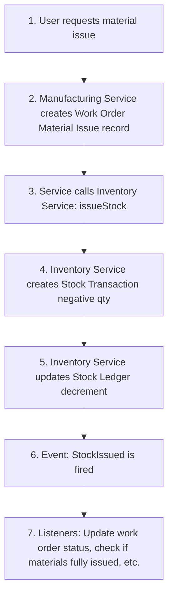
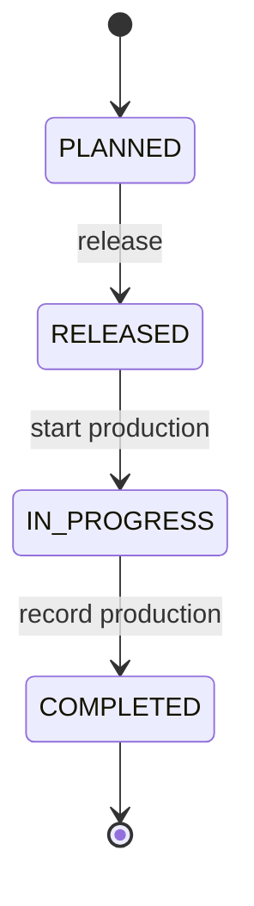
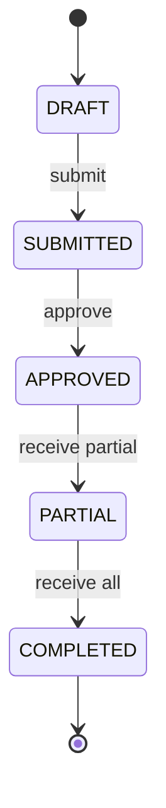

# SME Manufacturing ERP - Complete Product Documentation

## Table of Contents

1. [Project Overview](#1-project-overview)
2. [Architecture & Technical Stack](#2-architecture--technical-stack)
3. [Database Design Principles](#3-database-design-principles)
4. [Module Documentation](#4-module-documentation)
5. [API Design Standards](#5-api-design-standards)
6. [Authentication & Authorization](#6-authentication--authorization)
7. [Data Flow & Integration Patterns](#7-data-flow--integration-patterns)
8. [Development Guidelines](#8-development-guidelines)
9. [Phase-wise Implementation](#9-phase-wise-implementation)
10. [Appendix](#10-appendix)

---

## 1. Project Overview

### 1.1 Vision

Build a comprehensive, production-grade ERP system for Small and Medium Manufacturing Enterprises that handles all operations except core accounting. The system must be modular enough to transition from monolith to microservices without requiring a complete rewrite.

### 1.2 Core Principles

| Principle | Description |
|-----------|-------------|
| **Modular Monolith** | Strict module boundaries with no direct cross-module table access |
| **Event-Driven Communication** | Modules communicate through events/service layer |
| **Ledger-Based Architecture** | Never compute stock/balances from transactions |
| **API-First Design** | Every feature exposed via REST API |
| **Multi-tenancy Ready** | Single DB initially, designed for per-tenant databases later |

### 1.3 Technology Stack

| Layer | Technology |
|-------|------------|
| **Backend** | Laravel 10+ (PHP 8.2+) |
| **Frontend** | React 18+ with TypeScript |
| **Database** | PostgreSQL 15+ |
| **Cache** | Redis |
| **Queue** | Laravel Queue with Redis driver |
| **Storage** | S3-compatible storage for documents |

---

## 2. Architecture & Technical Stack

### 2.1 Monolithic Architecture (Phase 1-2)

```
┌─────────────────────────────────────────────────────────────┐
│                     React Frontend (SPA)                     │
│              (Separate views per module/role)                │
└────────────────────────┬────────────────────────────────────┘
                         │ REST API
┌────────────────────────▼────────────────────────────────────┐
│                    Laravel Backend                           │
│  ┌──────────────────────────────────────────────────────┐   │
│  │              API Routes & Controllers                 │   │
│  └───────────────────┬──────────────────────────────────┘   │
│  ┌───────────────────▼──────────────────────────────────┐   │
│  │           Service Layer (Business Logic)              │   │
│  │  • Manufacturing Services  • Inventory Services       │   │
│  │  • Procurement Services    • Sales Services           │   │
│  └───────────────────┬──────────────────────────────────┘   │
│  ┌───────────────────▼──────────────────────────────────┐   │
│  │              Repository Layer (Data)                  │   │
│  └───────────────────┬──────────────────────────────────┘   │
│  ┌───────────────────▼──────────────────────────────────┐   │
│  │                  Eloquent Models                      │   │
│  └───────────────────┬──────────────────────────────────┘   │
└────────────────────────┼────────────────────────────────────┘
                         │
┌────────────────────────▼────────────────────────────────────┐
│              PostgreSQL Database (Single)                    │
│  Schemas: manufacturing, inventory, procurement, sales, etc. │
└─────────────────────────────────────────────────────────────┘
```

### 2.2 Laravel Directory Structure

```
app/
├── Modules/
│   ├── Manufacturing/
│   │   ├── Controllers/
│   │   ├── Services/
│   │   ├── Repositories/
│   │   ├── Models/
│   │   ├── Events/
│   │   ├── Listeners/
│   │   ├── Requests/
│   │   ├── Resources/
│   │   └── Routes/
│   ├── Inventory/
│   ├── Procurement/
│   ├── Sales/
│   ├── Maintenance/
│   ├── HR/
│   ├── Compliance/
│   └── Shared/
│
├── Core/
│   ├── Events/
│   ├── Exceptions/
│   ├── Middleware/
│   └── Traits/
│
database/
├── migrations/
│   ├── manufacturing/
│   ├── inventory/
│   ├── procurement/
│   └── ...
├── seeders/
└── factories/

routes/
├── api/
│   ├── manufacturing.php
│   ├── inventory.php
│   └── ...
```

### 2.3 Database Schema Organization

Use PostgreSQL schemas for logical separation (helps with future microservices split):

```sql
-- Database: erp_main

-- Schemas
CREATE SCHEMA manufacturing;
CREATE SCHEMA inventory;
CREATE SCHEMA procurement;
CREATE SCHEMA sales;
CREATE SCHEMA maintenance;
CREATE SCHEMA hr;
CREATE SCHEMA compliance;
CREATE SCHEMA shared;
CREATE SCHEMA auth;
```

---


## 3. Database Design Principles

### 3.1 Core Principles

#### 3.1.1 Ledger Pattern (CRITICAL)

> [!WARNING]
> NEVER compute stock or balances from transactions. ALWAYS maintain ledgers.

**❌ BAD:** Computing stock from transactions
```sql
SELECT SUM(quantity) FROM stock_transactions WHERE item_id = 123;
```

**✅ GOOD:** Reading from ledger
```sql
SELECT balance FROM stock_ledger WHERE item_id = 123 AND warehouse_id = 1;
```

#### 3.1.2 Module Isolation

- Each module has its own schema/namespace
- No foreign keys across modules
- Communication via events and service layer
- Use UUID or composite keys for cross-module references

#### 3.1.3 Audit Trail

Every transactional table must have:

```sql
created_by UUID REFERENCES auth.users(id)
updated_by UUID REFERENCES auth.users(id)
created_at TIMESTAMP
updated_at TIMESTAMP
deleted_at TIMESTAMP  -- soft deletes
version INTEGER DEFAULT 1  -- optimistic locking
```

#### 3.1.4 Multi-tenancy Preparation

All tables must include:

```sql
organization_id UUID NOT NULL
-- Composite index on (organization_id, other_lookup_fields)
```

### 3.2 CRITICAL: Ledger Architecture Enforcement (NON-NEGOTIABLE)

> [!CAUTION]
> This section supersedes and corrects any conflicting patterns elsewhere in this doc.
> Failure to follow these rules WILL cause silent data corruption in production.

#### 3.2.1 The Stock Management Mental Model

```
FACTS (Immutable)           TRUTH (Derived)              OPINION (Reportable)
─────────────────           ────────────────             ────────────────────
stock_transactions    →     stock_ledger           →     inventory_valuation
(what happened)             (current state)              (snapshots)
                            
APPEND ONLY                 COMPUTED ONLY                REBUILD ONLY
```

**Memorize This:**
- **Facts are immutable** - Transactions are never updated or deleted
- **Truth is derived** - Ledger is computed from transactions
- **Opinions are rebuildable** - Valuation snapshots can be regenerated

#### 3.2.2 Non-Overlapping Table Responsibilities

| Table | Role | Can Be Written By |
|-------|------|-------------------|
| `stock_transactions` | Immutable event log | `InventoryPostingService` ONLY |
| `stock_ledger` | Derived current state | `InventoryPostingService` ONLY (via internal method) |
| `inventory_valuation` | Snapshot for reports | Scheduled job ONLY |
| `batch_movements` | Traceability view | Auto-derived from transactions |

**ABSOLUTE RULE:** No human, no controller, no admin UI writes to `stock_ledger` directly.

#### 3.2.3 Forbidden Patterns (NEVER DO THIS)

❌ **Direct Ledger Updates**
```php
// CATASTROPHIC - WILL CAUSE DATA CORRUPTION
StockLedger::updateOrCreate([
    'item_id' => $itemId,
    'warehouse_id' => $warehouseId,
], [
    'quantity_available' => DB::raw('quantity_available + 100')
]);
```

Why this is dangerous:
- Bypasses validation
- No audit trail
- Race conditions
- No compensating transaction
- Silent corruption

❌ **Transaction Updates**
```php
// CATASTROPHIC - DESTROYS AUDIT TRAIL
StockTransaction::where('id', $id)->update(['quantity' => 200]);
```

❌ **Admin "Fix Stock" Features**
- "Edit stock balance"
- "Correct quantity"
- "Set opening stock" (after go-live without adjustment document)

#### 3.2.4 Single Entry Point: InventoryPostingService

**THE ONLY WAY** to modify inventory:

```php
// Location: app/Modules/Inventory/Services/InventoryPostingService.php

class InventoryPostingService
{
    /**
     * THE ONLY ENTRY POINT FOR INVENTORY CHANGES
     * No other code should touch stock_transactions or stock_ledger directly.
     */
    public function post(
        string $transactionType,
        string $itemId,
        string $warehouseId,
        float $quantity,        // Positive for receipts, negative for issues
        float $unitCost,
        string $referenceType,
        string $referenceId,
        ?string $batchId = null
    ): StockTransaction {
        
        return DB::transaction(function () use (...) {
            
            // 1. VALIDATE BUSINESS RULES
            $this->validatePosting(...);
            
            // 2. CREATE IMMUTABLE TRANSACTION (THE FACT)
            $transaction = StockTransaction::create([
                'transaction_type' => $transactionType,
                'item_id' => $itemId,
                'warehouse_id' => $warehouseId,
                'batch_id' => $batchId,
                'quantity' => $quantity,
                'unit_cost' => $unitCost,
                'total_value' => $quantity * $unitCost,
                'reference_type' => $referenceType,
                'reference_id' => $referenceId,
                'created_by' => auth()->id(),
            ]);
            
            // 3. LOCK AND UPDATE LEDGER (THE TRUTH)
            $ledger = StockLedger::where('item_id', $itemId)
                ->where('warehouse_id', $warehouseId)
                ->where('batch_id', $batchId)
                ->lockForUpdate()
                ->firstOrNew([...]);
            
            $newQty = $ledger->quantity_available + $quantity;
            
            if ($newQty < 0 && !$warehouse->allow_negative_stock) {
                throw new NegativeStockNotAllowedException(...);
            }
            
            $ledger->quantity_available = $newQty;
            $ledger->last_transaction_id = $transaction->id;
            $ledger->last_updated = now();
            $ledger->save();
            
            // 4. EMIT DOMAIN EVENT
            event(new StockPosted($transaction));
            
            return $transaction;
        });
    }
    
    /**
     * Cancel a transaction (create compensating entry, never delete)
     */
    public function cancelTransaction(string $transactionId, string $reason): StockTransaction
    {
        $original = StockTransaction::findOrFail($transactionId);
        
        // Mark original as cancelled (metadata only)
        DB::table('inventory.stock_transactions')
            ->where('id', $transactionId)
            ->update([
                'is_cancelled' => true,
                'cancelled_reason' => $reason,
            ]);
        
        // Create reversal transaction (the opposite)
        return $this->post(
            transactionType: $original->transaction_type . '_REVERSAL',
            itemId: $original->item_id,
            warehouseId: $original->warehouse_id,
            quantity: -1 * $original->quantity,
            unitCost: $original->unit_cost,
            referenceType: 'CANCELLATION',
            referenceId: $original->id,
            batchId: $original->batch_id
        );
    }
}
```

#### 3.2.5 Correct Usage Examples

✅ **GRN Receipt**
```php
app(InventoryPostingService::class)->post(
    transactionType: 'RECEIPT',
    itemId: $line->item_id,
    warehouseId: $grn->warehouse_id,
    quantity: $line->accepted_quantity,  // Positive
    unitCost: $line->unit_price,
    referenceType: 'GRN',
    referenceId: $grn->id,
    batchId: $line->batch_id
);
```

✅ **Work Order Material Issue**
```php
app(InventoryPostingService::class)->post(
    transactionType: 'ISSUE',
    itemId: $material->item_id,
    warehouseId: $workOrder->source_warehouse_id,
    quantity: -$material->issued_quantity,  // Negative
    unitCost: $ledger->unit_cost,
    referenceType: 'WORK_ORDER',
    referenceId: $workOrder->id
);
```

✅ **Stock Adjustment (After Approval)**
```php
// Only after adjustment document is approved
app(InventoryPostingService::class)->post(
    transactionType: 'ADJUSTMENT',
    itemId: $line->item_id,
    warehouseId: $adjustment->warehouse_id,
    quantity: $line->difference,  // Can be positive or negative
    unitCost: $ledger->unit_cost,
    referenceType: 'STOCK_ADJUSTMENT',
    referenceId: $adjustment->id
);
```

#### 3.2.6 Database-Level Enforcement

**1. Make Transactions Immutable**
```sql
-- Revoke direct access
REVOKE UPDATE, DELETE ON inventory.stock_transactions FROM PUBLIC;

-- Or with trigger (defense in depth)
CREATE OR REPLACE FUNCTION prevent_stock_transaction_changes()
RETURNS TRIGGER AS $$
BEGIN
    RAISE EXCEPTION 'Stock transactions are immutable. Create a reversal instead.';
END;
$$ LANGUAGE plpgsql;

CREATE TRIGGER no_update_stock_transactions
    BEFORE UPDATE OR DELETE ON inventory.stock_transactions
    FOR EACH ROW EXECUTE FUNCTION prevent_stock_transaction_changes();
```

**2. Prevent Manual Ledger Updates**
```sql
-- Only the application role can touch this
REVOKE UPDATE, DELETE ON inventory.stock_ledger FROM PUBLIC;
```

**3. Prevent Negative Stock**
```sql
ALTER TABLE inventory.stock_ledger
ADD CONSTRAINT chk_non_negative_stock
CHECK (quantity_available >= 0);
-- Note: Warehouses with allow_negative_stock use a different table or nullable column
```

**4. Batch Movements Must Reference Transactions**
```sql
ALTER TABLE inventory.batch_movements
ADD CONSTRAINT fk_batch_movement_transaction
FOREIGN KEY (stock_transaction_id) 
REFERENCES inventory.stock_transactions(id) ON DELETE RESTRICT;
```

#### 3.2.7 Valuation Is Read-Only

**Rules:**
- Valuation tables are snapshots for reporting
- They are always rebuildable from `stock_ledger`
- They NEVER drive stock movements

**If valuation is wrong:**
1. Investigate the underlying transactions
2. Create adjustment document if needed
3. Rebuild valuation snapshot
4. **NEVER** adjust stock to match valuation

#### 3.2.8 Kill the "Fix Stock" UI Pattern

> [!WARNING]
> This is where ERPs die. Do not implement these features.

**NEVER Allow:**
- "Edit stock" button
- "Correct balance" action
- "Set opening stock" after go-live (without adjustment document)
- Direct SQL access in production

**ALWAYS Require:**
- Stock Adjustment document
- Approval workflow (two-person rule)
- Adjustment → Transaction → Ledger flow

#### 3.2.9 Code Review Checklist

Before merging any inventory-related code:

- [ ] No direct writes to `stock_ledger` outside `InventoryPostingService`
- [ ] No direct writes to `stock_transactions` outside `InventoryPostingService`
- [ ] No UPDATE/DELETE on transactions (use `cancelTransaction()`)
- [ ] All batch movements reference `stock_transaction_id`
- [ ] Stock adjustments go through approval workflow
- [ ] Valuation code is read-only

#### 3.2.10 Architecture Diagram

```
┌─────────────────────────────────────────────────────────┐
│                  APPLICATION LAYER                       │
│  GRN, Work Orders, Sales Dispatch, Adjustments          │
└────────────────────┬────────────────────────────────────┘
                     │ (calls only)
                     ▼
┌─────────────────────────────────────────────────────────┐
│          InventoryPostingService (SINGLE ENTRY)         │
│  • Validates business rules                             │
│  • Creates immutable transaction (FACT)                 │
│  • Updates derived ledger (TRUTH)                       │
│  • Emits domain events                                  │
│  • Fails atomically                                     │
└────────────┬───────────────────────┬────────────────────┘
             │                       │
             ▼                       ▼
┌────────────────────┐    ┌──────────────────────┐
│ stock_transactions │    │   stock_ledger       │
│  (IMMUTABLE FACTS) │    │  (DERIVED TRUTH)     │
│  • Append only     │    │  • Computed only     │
│  • Never update    │    │  • Never direct write│
│  • Never delete    │    │  • Rebuild-able      │
└────────────────────┘    └──────────────────────┘
             │                       │
             └───────────┬───────────┘
                         ▼
              ┌─────────────────────┐
              │  batch_movements    │
              │  (DERIVED TRACE)    │
              │  • FK to transaction│
              └─────────────────────┘
                         │
                         ▼
              ┌─────────────────────┐
              │ inventory_valuation │
              │ (SNAPSHOT OPINION)  │
              │  • Read only        │
              │  • Rebuild-able     │
              └─────────────────────┘
```

### 3.3 Common Table Patterns

#### 3.3.1 Transaction + Ledger Pattern

```sql
-- Transaction Table (immutable events)
CREATE TABLE inventory.stock_transactions (
    id UUID PRIMARY KEY,
    organization_id UUID NOT NULL,
    transaction_type VARCHAR(50), -- 'RECEIPT', 'ISSUE', 'ADJUSTMENT'
    item_id UUID NOT NULL,
    warehouse_id UUID NOT NULL,
    quantity DECIMAL(15,4),
    reference_type VARCHAR(100), -- 'GRN', 'WORK_ORDER', etc.
    reference_id UUID,
    transaction_date TIMESTAMP,
    created_by UUID,
    created_at TIMESTAMP
);

-- Ledger Table (current state)
CREATE TABLE inventory.stock_ledger (
    id UUID PRIMARY KEY,
    organization_id UUID NOT NULL,
    item_id UUID NOT NULL,
    warehouse_id UUID NOT NULL,
    batch_id UUID,
    quantity_available DECIMAL(15,4),
    quantity_reserved DECIMAL(15,4),
    quantity_in_transit DECIMAL(15,4),
    last_transaction_id UUID,
    last_updated TIMESTAMP,
    
    UNIQUE(organization_id, item_id, warehouse_id, batch_id)
);

CREATE INDEX idx_stock_ledger_lookup 
ON inventory.stock_ledger(organization_id, item_id, warehouse_id);

```

#### 3.3.2 Document Header + Lines Pattern

```sql
-- Header
CREATE TABLE procurement.purchase_orders (
    id UUID PRIMARY KEY,
    organization_id UUID NOT NULL,
    po_number VARCHAR(50) UNIQUE,
    vendor_id UUID NOT NULL,
    order_date DATE,
    expected_date DATE,
    status VARCHAR(20), -- 'DRAFT', 'SUBMITTED', 'APPROVED', 'PARTIAL', 'COMPLETED', 'CANCELLED'
    total_amount DECIMAL(15,2),
    currency VARCHAR(3),
    -- audit fields
);

-- Lines
CREATE TABLE procurement.purchase_order_lines (
    id UUID PRIMARY KEY,
    organization_id UUID NOT NULL,
    purchase_order_id UUID REFERENCES procurement.purchase_orders(id),
    line_number INTEGER,
    item_id UUID NOT NULL,
    description TEXT,
    quantity DECIMAL(15,4),
    unit_price DECIMAL(15,4),
    tax_amount DECIMAL(15,2),
    line_amount DECIMAL(15,2),
    received_quantity DECIMAL(15,4) DEFAULT 0,
    -- audit fields
    
    UNIQUE(purchase_order_id, line_number)
);

```

#### 3.3.3 Status State Machine

```sql
CREATE TABLE shared.status_transitions (
    id UUID PRIMARY KEY,
    entity_type VARCHAR(100), -- 'PURCHASE_ORDER', 'WORK_ORDER', etc.
    from_status VARCHAR(50),
    to_status VARCHAR(50),
    is_allowed BOOLEAN DEFAULT true,
    requires_approval BOOLEAN DEFAULT false,
    approval_role VARCHAR(50),
    
    UNIQUE(entity_type, from_status, to_status)
);

```

---

## 4. Module Documentation

### 4.1 Manufacturing Module

The manufacturing module is the heart of the ERP, handling production planning, execution, costing, and quality control.

#### 4.1.1 BOM (Bill of Materials)

**Purpose:** Define product recipes and component hierarchies.

**Database Schema:**

```sql
-- BOM Header
CREATE TABLE manufacturing.bom_headers (
    id UUID PRIMARY KEY,
    organization_id UUID NOT NULL,
    item_id UUID NOT NULL, -- finished good
    bom_number VARCHAR(50) UNIQUE,
    version INTEGER DEFAULT 1,
    is_active BOOLEAN DEFAULT true,
    effective_from DATE,
    effective_to DATE,
    base_quantity DECIMAL(15,4) DEFAULT 1, -- quantity this BOM produces
    uom_id UUID,
    routing_id UUID, -- links to routing/process
    estimated_cost DECIMAL(15,4),
    notes TEXT,
    created_by UUID,
    updated_by UUID,
    created_at TIMESTAMP,
    updated_at TIMESTAMP,
    
    UNIQUE(organization_id, item_id, version)
);

-- BOM Lines (Components)
CREATE TABLE manufacturing.bom_lines (
    id UUID PRIMARY KEY,
    organization_id UUID NOT NULL,
    bom_header_id UUID REFERENCES manufacturing.bom_headers(id) ON DELETE CASCADE,
    line_number INTEGER,
    component_item_id UUID NOT NULL,
    quantity_per_unit DECIMAL(15,6), -- quantity needed for base_quantity
    uom_id UUID,
    scrap_percentage DECIMAL(5,2) DEFAULT 0,
    operation_sequence INTEGER, -- which step needs this component
    is_critical BOOLEAN DEFAULT false,
    substitute_item_id UUID, -- alternative component
    notes TEXT,
    created_at TIMESTAMP,
    updated_at TIMESTAMP,
    
    UNIQUE(bom_header_id, line_number)
);

-- BOM Routing (Manufacturing Process)
CREATE TABLE manufacturing.routings (
    id UUID PRIMARY KEY,
    organization_id UUID NOT NULL,
    routing_number VARCHAR(50) UNIQUE,
    name VARCHAR(255),
    description TEXT,
    created_at TIMESTAMP
);

CREATE TABLE manufacturing.routing_operations (
    id UUID PRIMARY KEY,
    organization_id UUID NOT NULL,
    routing_id UUID REFERENCES manufacturing.routings(id),
    sequence INTEGER,
    operation_name VARCHAR(255),
    work_center_id UUID, -- machine/station
    setup_time_minutes INTEGER,
    run_time_per_unit DECIMAL(10,2), -- minutes
    labor_hours_per_unit DECIMAL(10,4),
    quality_check_required BOOLEAN DEFAULT false,
    
    UNIQUE(routing_id, sequence)
);

CREATE INDEX idx_bom_headers_item ON manufacturing.bom_headers(organization_id, item_id, is_active);
CREATE INDEX idx_bom_lines_component ON manufacturing.bom_lines(organization_id, component_item_id);
```

**Key APIs:**

```
POST   /api/manufacturing/boms
GET    /api/manufacturing/boms
GET    /api/manufacturing/boms/{id}
PUT    /api/manufacturing/boms/{id}
DELETE /api/manufacturing/boms/{id}
POST   /api/manufacturing/boms/{id}/explode  // Get full component tree
GET    /api/manufacturing/boms/by-item/{itemId}
POST   /api/manufacturing/boms/{id}/version  // Create new version
```

**Business Rules:**

- Only one active BOM per item at a time
- BOM explosion must handle circular dependencies (throw error)
- Component availability check before production planning
- Cost roll-up: raw material + labor + overhead
- Version control: deactivate old, activate new

#### 4.1.2 Production Planning

**Purpose:** Create production schedules based on sales orders, stock levels, and capacity.

**Database Schema:**

```sql
CREATE TABLE manufacturing.production_plans (
    id UUID PRIMARY KEY,
    organization_id UUID NOT NULL,
    plan_number VARCHAR(50) UNIQUE,
    plan_date DATE,
    planning_period_start DATE,
    planning_period_end DATE,
    status VARCHAR(20), -- 'DRAFT', 'APPROVED', 'EXECUTING', 'COMPLETED'
    created_by UUID,
    approved_by UUID,
    approved_at TIMESTAMP,
    created_at TIMESTAMP,
    updated_at TIMESTAMP
);

CREATE TABLE manufacturing.production_plan_items (
    id UUID PRIMARY KEY,
    organization_id UUID NOT NULL,
    production_plan_id UUID REFERENCES manufacturing.production_plans(id),
    item_id UUID NOT NULL,
    planned_quantity DECIMAL(15,4),
    scheduled_start_date DATE,
    scheduled_end_date DATE,
    priority INTEGER DEFAULT 5,
    demand_source VARCHAR(50), -- 'SALES_ORDER', 'FORECAST', 'STOCK_REPLENISHMENT'
    demand_reference_id UUID,
    work_orders_generated BOOLEAN DEFAULT false,
    
    UNIQUE(production_plan_id, item_id, scheduled_start_date)
);

CREATE INDEX idx_production_plans_period ON manufacturing.production_plans(organization_id, planning_period_start, planning_period_end);

```

**Key APIs:**

```
POST   /api/manufacturing/production-plans
GET    /api/manufacturing/production-plans
POST   /api/manufacturing/production-plans/{id}/approve
POST   /api/manufacturing/production-plans/{id}/generate-work-orders
GET    /api/manufacturing/production-plans/{id}/capacity-analysis
GET    /api/manufacturing/production-plans/{id}/material-requirements  // MRP

```

**Business Rules:**

- Material Requirements Planning (MRP): explode BOM, check stock, generate purchase requisitions
- Capacity planning: check work center availability
- Lead time calculation based on routing
- Priority-based scheduling

#### 4.1.3 Work Orders

**Purpose:** Execution documents for manufacturing jobs.

**Database Schema:**

```sql
CREATE TABLE manufacturing.work_orders (
    id UUID PRIMARY KEY,
    organization_id UUID NOT NULL,
    wo_number VARCHAR(50) UNIQUE,
    production_plan_item_id UUID,
    item_id UUID NOT NULL, -- what to produce
    bom_id UUID,
    routing_id UUID,
    planned_quantity DECIMAL(15,4),
    completed_quantity DECIMAL(15,4) DEFAULT 0,
    rejected_quantity DECIMAL(15,4) DEFAULT 0,
    status VARCHAR(20), -- 'PLANNED', 'RELEASED', 'IN_PROGRESS', 'COMPLETED', 'CANCELLED'
    priority INTEGER DEFAULT 5,
    scheduled_start_date TIMESTAMP,
    scheduled_end_date TIMESTAMP,
    actual_start_date TIMESTAMP,
    actual_end_date TIMESTAMP,
    warehouse_id UUID, -- where finished goods go
    source_warehouse_id UUID, -- where raw materials come from
    
    created_by UUID,
    released_by UUID,
    completed_by UUID,
    created_at TIMESTAMP,
    updated_at TIMESTAMP,
    
    CONSTRAINT chk_wo_quantity CHECK (planned_quantity > 0)
);

-- Material Allocation
CREATE TABLE manufacturing.work_order_materials (
    id UUID PRIMARY KEY,
    organization_id UUID NOT NULL,
    work_order_id UUID REFERENCES manufacturing.work_orders(id),
    line_number INTEGER,
    item_id UUID NOT NULL,
    required_quantity DECIMAL(15,4),
    allocated_quantity DECIMAL(15,4) DEFAULT 0,
    issued_quantity DECIMAL(15,4) DEFAULT 0,
    batch_id UUID,
    warehouse_id UUID,
    operation_sequence INTEGER,
    
    UNIQUE(work_order_id, line_number)
);

-- Operation Tracking
CREATE TABLE manufacturing.work_order_operations (
    id UUID PRIMARY KEY,
    organization_id UUID NOT NULL,
    work_order_id UUID REFERENCES manufacturing.work_orders(id),
    sequence INTEGER,
    routing_operation_id UUID,
    operation_name VARCHAR(255),
    work_center_id UUID,
    status VARCHAR(20), -- 'PENDING', 'IN_PROGRESS', 'COMPLETED', 'SKIPPED'
    planned_start TIMESTAMP,
    planned_end TIMESTAMP,
    actual_start TIMESTAMP,
    actual_end TIMESTAMP,
    performed_by UUID,
    
    UNIQUE(work_order_id, sequence)
);

-- Time Tracking
CREATE TABLE manufacturing.work_order_time_logs (
    id UUID PRIMARY KEY,
    organization_id UUID NOT NULL,
    work_order_id UUID REFERENCES manufacturing.work_orders(id),
    operation_id UUID REFERENCES manufacturing.work_order_operations(id),
    employee_id UUID,
    start_time TIMESTAMP,
    end_time TIMESTAMP,
    duration_minutes INTEGER,
    quantity_produced DECIMAL(15,4),
    notes TEXT,
    created_at TIMESTAMP
);

CREATE INDEX idx_work_orders_status ON manufacturing.work_orders(organization_id, status, scheduled_start_date);
CREATE INDEX idx_work_orders_item ON manufacturing.work_orders(organization_id, item_id);

```

**Key APIs:**

```
POST   /api/manufacturing/work-orders
GET    /api/manufacturing/work-orders
GET    /api/manufacturing/work-orders/{id}
POST   /api/manufacturing/work-orders/{id}/release
POST   /api/manufacturing/work-orders/{id}/allocate-materials
POST   /api/manufacturing/work-orders/{id}/issue-materials
POST   /api/manufacturing/work-orders/{id}/start-operation/{operationId}
POST   /api/manufacturing/work-orders/{id}/complete-operation/{operationId}
POST   /api/manufacturing/work-orders/{id}/record-production
POST   /api/manufacturing/work-orders/{id}/complete
GET    /api/manufacturing/work-orders/{id}/material-shortage

```

**Business Rules:**

- Status flow: PLANNED → RELEASED → IN_PROGRESS → COMPLETED
- Can only release if materials available (or allow partial release)
- Material issue creates negative inventory transaction
- Production completion creates positive inventory transaction
- Backflushing option: auto-issue materials on completion
- Costing: actual vs standard cost tracking

**Business Logic:**

```php
// Material Issue - USES InventoryPostingService (Section 3.2)
public function issueMaterials($workOrderId, array $materials) {
    DB::transaction(function() use ($workOrderId, $materials) {
        $wo = WorkOrder::findOrFail($workOrderId);
        $inventoryService = app(InventoryPostingService::class);
        
        foreach ($materials as $material) {
            $woMaterial = $wo->materials()->find($material['work_order_material_id']);
            
            // Get cost from ledger
            $ledger = StockLedger::where('item_id', $woMaterial->item_id)
                ->where('warehouse_id', $wo->source_warehouse_id)
                ->where('batch_id', $material['batch_id'] ?? null)
                ->first();
            
            // POST TO INVENTORY - NEGATIVE quantity for issues
            $inventoryService->post(
                transactionType: 'PRODUCTION_ISSUE',
                itemId: $woMaterial->item_id,
                warehouseId: $wo->source_warehouse_id,
                quantity: -$material['quantity'],  // NEGATIVE
                unitCost: $ledger->unit_cost ?? 0,
                referenceType: 'WORK_ORDER',
                referenceId: $wo->id,
                batchId: $material['batch_id'] ?? null
            );
            
            // Update WO material issued quantity
            $woMaterial->increment('issued_quantity', $material['quantity']);
        }
        
        // Update WO status if first issue
        if ($wo->status === 'RELEASED') {
            $wo->update([
                'status' => 'IN_PROGRESS',
                'actual_start_date' => now()
            ]);
        }
        
        event(new MaterialsIssued($wo, $materials));
    });
}

// Production Receipt - USES InventoryPostingService (Section 3.2)
public function recordProduction($workOrderId, array $data) {
    DB::transaction(function() use ($workOrderId, $data) {
        $wo = WorkOrder::findOrFail($workOrderId);
        $inventoryService = app(InventoryPostingService::class);
        
        // Calculate unit cost from issued materials + labor
        $unitCost = $this->calculateUnitCost($wo, $data['quantity']);
        
        // Create batch for finished goods if required
        $batchId = null;
        if ($wo->item->is_batch_tracked) {
            $batch = Batch::create([
                'item_id' => $wo->item_id,
                'batch_number' => $data['batch_number'] ?? $this->generateBatchNumber($wo),
                'work_order_id' => $wo->id,
                'manufacturing_date' => now(),
            ]);
            $batchId = $batch->id;
        }
        
        // POST TO INVENTORY - POSITIVE quantity for receipts
        $inventoryService->post(
            transactionType: 'PRODUCTION_RECEIPT',
            itemId: $wo->item_id,
            warehouseId: $wo->warehouse_id,
            quantity: $data['quantity'],  // POSITIVE
            unitCost: $unitCost,
            referenceType: 'WORK_ORDER',
            referenceId: $wo->id,
            batchId: $batchId
        );
        
        // Update WO completed quantity
        $wo->increment('completed_quantity', $data['quantity']);
        
        // Create production entry record
        ProductionEntry::create([
            'work_order_id' => $wo->id,
            'quantity_produced' => $data['quantity'],
            'batch_id' => $batchId,
            // ...
        ]);
        
        event(new ProductionRecorded($wo, $data['quantity']));
    });
}
```

#### 4.1.4 Production Execution

**Purpose:** Real-time shop floor data capture.

**Database Schema:**

```sql
-- Production Entries (what was produced when)
CREATE TABLE manufacturing.production_entries (
    id UUID PRIMARY KEY,
    organization_id UUID NOT NULL,
    entry_number VARCHAR(50) UNIQUE,
    work_order_id UUID REFERENCES manufacturing.work_orders(id),
    item_id UUID NOT NULL,
    quantity_produced DECIMAL(15,4),
    quantity_rejected DECIMAL(15,4),
    warehouse_id UUID,
    batch_number VARCHAR(100),
    production_date TIMESTAMP,
    shift_id UUID,
    supervisor_id UUID,
    notes TEXT,
    created_by UUID,
    created_at TIMESTAMP,
    
    -- This creates inventory transaction
    inventory_transaction_id UUID
);

-- Material Consumption (actual vs planned)
CREATE TABLE manufacturing.material_consumption (
    id UUID PRIMARY KEY,
    organization_id UUID NOT NULL,
    production_entry_id UUID REFERENCES manufacturing.production_entries(id),
    work_order_id UUID REFERENCES manufacturing.work_orders(id),
    item_id UUID NOT NULL,
    planned_quantity DECIMAL(15,4),
    actual_quantity DECIMAL(15,4),
    variance DECIMAL(15,4), -- actual - planned
    batch_id UUID,
    warehouse_id UUID,
    created_at TIMESTAMP,
    
    -- This creates inventory transaction
    inventory_transaction_id UUID
);

-- Rejection/Rework
CREATE TABLE manufacturing.quality_rejections (
    id UUID PRIMARY KEY,
    organization_id UUID NOT NULL,
    production_entry_id UUID,
    work_order_id UUID,
    item_id UUID,
    rejected_quantity DECIMAL(15,4),
    rejection_reason VARCHAR(255),
    defect_type VARCHAR(100),
    disposition VARCHAR(50), -- 'SCRAP', 'REWORK', 'USE_AS_IS', 'RETURN_TO_VENDOR'
    rework_work_order_id UUID,
    rejected_by UUID,
    created_at TIMESTAMP
);

CREATE INDEX idx_production_entries_wo ON manufacturing.production_entries(organization_id, work_order_id);
CREATE INDEX idx_production_entries_date ON manufacturing.production_entries(organization_id, production_date);

```

**Key APIs:**

```
POST   /api/manufacturing/production-entries
GET    /api/manufacturing/production-entries
POST   /api/manufacturing/production-entries/{id}/reject-quantity
POST   /api/manufacturing/production-entries/{id}/create-rework-order
GET    /api/manufacturing/shop-floor/active-work-orders
POST   /api/manufacturing/shop-floor/clock-in
POST   /api/manufacturing/shop-floor/clock-out

```

#### 4.1.5 Costing

**Purpose:** Track and analyze manufacturing costs.

**Database Schema:**

```sql
-- Cost Centers
CREATE TABLE manufacturing.cost_centers (
    id UUID PRIMARY KEY,
    organization_id UUID NOT NULL,
    code VARCHAR(50) UNIQUE,
    name VARCHAR(255),
    category VARCHAR(50), -- 'DIRECT', 'INDIRECT', 'OVERHEAD'
    is_active BOOLEAN DEFAULT true
);

-- Work Order Costing
CREATE TABLE manufacturing.work_order_costs (
    id UUID PRIMARY KEY,
    organization_id UUID NOT NULL,
    work_order_id UUID REFERENCES manufacturing.work_orders(id),
    cost_type VARCHAR(50), -- 'MATERIAL', 'LABOR', 'OVERHEAD', 'SUBCONTRACTING'
    cost_center_id UUID,
    
    standard_cost DECIMAL(15,4),
    actual_cost DECIMAL(15,4),
    variance DECIMAL(15,4),
    
    quantity DECIMAL(15,4), -- hours, kgs, etc.
    rate DECIMAL(15,4),
    
    calculation_date TIMESTAMP,
    notes TEXT,
    
    UNIQUE(work_order_id, cost_type, cost_center_id)
);

-- Item Standard Costs
CREATE TABLE manufacturing.item_standard_costs (
    id UUID PRIMARY KEY,
    organization_id UUID NOT NULL,
    item_id UUID NOT NULL,
    effective_from DATE,
    effective_to DATE,
    
    material_cost DECIMAL(15,4),
    labor_cost DECIMAL(15,4),
    overhead_cost DECIMAL(15,4),
    total_cost DECIMAL(15,4),
    
    costing_method VARCHAR(20), -- 'STANDARD', 'AVERAGE', 'FIFO', 'LIFO'
    last_calculated TIMESTAMP,
    
    UNIQUE(organization_id, item_id, effective_from)
);

CREATE INDEX idx_wo_costs_wo ON manufacturing.work_order_costs(work_order_id);

```

**Key APIs:**

```
POST   /api/manufacturing/costing/calculate-work-order/{woId}
GET    /api/manufacturing/costing/work-order/{woId}
GET    /api/manufacturing/costing/variance-analysis
POST   /api/manufacturing/costing/update-standard-costs
GET    /api/manufacturing/costing/cost-trends

```

**Business Rules:**

- Standard cost from BOM + Routing
- Actual cost from production entries + time logs
- Variance analysis: material, labor, overhead
- Cost roll-up for assemblies
- Periodic cost recalculation

#### 4.1.6 Quality Control

**Purpose:** Quality checks, inspections, and certifications.

**Database Schema:**

```sql
-- Quality Parameters
CREATE TABLE manufacturing.quality_parameters (
    id UUID PRIMARY KEY,
    organization_id UUID NOT NULL,
    code VARCHAR(50) UNIQUE,
    name VARCHAR(255),
    parameter_type VARCHAR(50), -- 'NUMERIC', 'TEXT', 'PASS_FAIL', 'VISUAL'
    uom_id UUID,
    min_value DECIMAL(15,4),
    max_value DECIMAL(15,4),
    target_value DECIMAL(15,4),
    tolerance DECIMAL(15,4),
    is_critical BOOLEAN DEFAULT false
);

-- Quality Inspection Templates
CREATE TABLE manufacturing.quality_inspection_templates (
    id UUID PRIMARY KEY,
    organization_id UUID NOT NULL,
    template_code VARCHAR(50) UNIQUE,
    name VARCHAR(255),
    inspection_type VARCHAR(50), -- 'INCOMING', 'IN_PROCESS', 'FINAL', 'OUTGOING'
    applicable_to VARCHAR(50), -- 'ITEM', 'OPERATION', 'VENDOR'
    frequency VARCHAR(50), -- 'EVERY_BATCH', 'SAMPLING', 'PERIODIC'
    sampling_size INTEGER
);

CREATE TABLE manufacturing.quality_template_parameters (
    id UUID PRIMARY KEY,
    template_id UUID REFERENCES manufacturing.quality_inspection_templates(id),
    parameter_id UUID REFERENCES manufacturing.quality_parameters(id),
    is_mandatory BOOLEAN DEFAULT true,
    sequence INTEGER,
    
    UNIQUE(template_id, parameter_id)
);

-- Quality Inspections
CREATE TABLE manufacturing.quality_inspections (
    id UUID PRIMARY KEY,
    organization_id UUID NOT NULL,
    inspection_number VARCHAR(50) UNIQUE,
    template_id UUID REFERENCES manufacturing.quality_inspection_templates(id),
    
    reference_type VARCHAR(50), -- 'WORK_ORDER', 'GRN', 'BATCH'
    reference_id UUID,
    
    item_id UUID,
    batch_id UUID,
    quantity_inspected DECIMAL(15,4),
    
    inspection_date TIMESTAMP,
    inspected_by UUID,
    status VARCHAR(20), -- 'PENDING', 'IN_PROGRESS', 'PASSED', 'FAILED', 'CONDITIONAL'
    
    overall_result VARCHAR(20), -- 'ACCEPTED', 'REJECTED', 'REWORK'
    remarks TEXT,
    
    approved_by UUID,
    approved_at TIMESTAMP
);

CREATE TABLE manufacturing.quality_inspection_readings (
    id UUID PRIMARY KEY,
    inspection_id UUID REFERENCES manufacturing.quality_inspections(id),
    parameter_id UUID REFERENCES manufacturing.quality_parameters(id),
    
    reading_value VARCHAR(255),
    numeric_value DECIMAL(15,4),
    is_within_spec BOOLEAN,
    
    notes TEXT,
    created_at TIMESTAMP
);

-- Non-Conformance Reports
CREATE TABLE manufacturing.ncr_reports (
    id UUID PRIMARY KEY,
    organization_id UUID NOT NULL,
    ncr_number VARCHAR(50) UNIQUE,
    inspection_id UUID,
    
    defect_description TEXT,
    root_cause TEXT,
    corrective_action TEXT,
    preventive_action TEXT,
    
    raised_by UUID,
    assigned_to UUID,
    status VARCHAR(20), -- 'OPEN', 'IN_PROGRESS', 'RESOLVED', 'CLOSED'
    
    raised_at TIMESTAMP,
    resolved_at TIMESTAMP,
    closed_at TIMESTAMP
);

CREATE INDEX idx_quality_inspections_ref ON manufacturing.quality_inspections(organization_id, reference_type, reference_id);

```

**Key APIs:**

```
POST   /api/manufacturing/quality/templates
GET    /api/manufacturing/quality/templates
POST   /api/manufacturing/quality/inspections
GET    /api/manufacturing/quality/inspections
PUT    /api/manufacturing/quality/inspections/{id}/record-readings
POST   /api/manufacturing/quality/inspections/{id}/complete
POST   /api/manufacturing/quality/ncr
GET    /api/manufacturing/quality/ncr
GET    /api/manufacturing/quality/reports/defect-analysis

```

#### 4.1.7 Scrap Management

**Purpose:** Track and analyze production waste.

**Database Schema:**

```sql
CREATE TABLE manufacturing.scrap_entries (
    id UUID PRIMARY KEY,
    organization_id UUID NOT NULL,
    scrap_number VARCHAR(50) UNIQUE,
    
    source_type VARCHAR(50), -- 'WORK_ORDER', 'QUALITY_REJECTION', 'MAINTENANCE', 'GENERAL'
    source_id UUID,
    
    item_id UUID NOT NULL,
    scrap_quantity DECIMAL(15,4),
    scrap_value DECIMAL(15,4), -- recoverable value
    
    scrap_reason VARCHAR(255),
    scrap_category VARCHAR(50), -- 'NORMAL', 'ABNORMAL', 'PROCESS', 'MATERIAL_DEFECT'
    
    warehouse_id UUID,
    batch_id UUID,
    
    disposal_method VARCHAR(50), -- 'RECYCLE', 'SELL', 'DISPOSE', 'REWORK'
    disposed_quantity DECIMAL(15,4),
    disposal_date DATE,
    
    recorded_by UUID,
    created_at TIMESTAMP,
    
    -- Creates inventory transaction
    inventory_transaction_id UUID
);

-- Scrap Recovery
CREATE TABLE manufacturing.scrap_recovery (
    id UUID PRIMARY KEY,
    scrap_entry_id UUID REFERENCES manufacturing.scrap_entries(id),
    recovered_item_id UUID, -- what was recovered
    recovered_quantity DECIMAL(15,4),
    recovery_value DECIMAL(15,4),
    recovery_date DATE,
    sold_to VARCHAR(255),
    notes TEXT
);

CREATE INDEX idx_scrap_entries_item ON manufacturing.scrap_entries(organization_id, item_id);
CREATE INDEX idx_scrap_entries_date ON manufacturing.scrap_entries(organization_id, created_at);

```

**Key APIs:**

```
POST   /api/manufacturing/scrap
GET    /api/manufacturing/scrap
POST   /api/manufacturing/scrap/{id}/dispose
POST   /api/manufacturing/scrap/{id}/recover
GET    /api/manufacturing/scrap/analysis
GET    /api/manufacturing/scrap/trends


```

---

### 4.2 Inventory Module

**Purpose:** Real-time stock tracking, warehouse management, batch tracking, and valuation.

#### 4.2.1 Core Principles

> [!IMPORTANT]
> Review Section 3.2 for the complete Ledger Architecture Enforcement rules.

- **NEVER** compute stock from transactions - always read from ledger
- All movements through transactions → ledger updates
- Support multiple warehouses, bins, batches
- FIFO/LIFO/Average costing methods

#### 4.2.2 Stock Ledger (THE SINGLE SOURCE OF TRUTH)

**Database Schema:**

```sql
-- Stock Ledger - THE MASTER
CREATE TABLE inventory.stock_ledger (
    id UUID PRIMARY KEY,
    organization_id UUID NOT NULL,
    
    item_id UUID NOT NULL,
    warehouse_id UUID NOT NULL,
    bin_location VARCHAR(50),
    batch_id UUID,
    
    -- Quantities
    quantity_available DECIMAL(15,4) NOT NULL DEFAULT 0,
    quantity_reserved DECIMAL(15,4) NOT NULL DEFAULT 0, -- allocated to orders
    quantity_in_transit DECIMAL(15,4) NOT NULL DEFAULT 0, -- between warehouses
    quantity_in_quality_hold DECIMAL(15,4) NOT NULL DEFAULT 0,
    
    -- Costing
    unit_cost DECIMAL(15,4),
    total_value DECIMAL(15,4),
    
    -- Tracking
    last_transaction_id UUID,
    last_transaction_date TIMESTAMP,
    last_updated TIMESTAMP,
    
    -- For multi-tenancy
    UNIQUE(organization_id, item_id, warehouse_id, COALESCE(batch_id, '00000000-0000-0000-0000-000000000000'::UUID), COALESCE(bin_location, ''))
);

CREATE INDEX idx_stock_ledger_lookup ON inventory.stock_ledger(organization_id, item_id, warehouse_id);
CREATE INDEX idx_stock_ledger_batch ON inventory.stock_ledger(organization_id, batch_id) WHERE batch_id IS NOT NULL;
CREATE INDEX idx_stock_ledger_low_stock ON inventory.stock_ledger(organization_id, item_id) 
    WHERE quantity_available < 10; -- adjust threshold

-- View for available stock (most common query)
CREATE VIEW inventory.v_available_stock AS
SELECT 
    organization_id,
    item_id,
    warehouse_id,
    SUM(quantity_available) as available,
    SUM(quantity_reserved) as reserved,
    SUM(quantity_available - quantity_reserved) as free_stock
FROM inventory.stock_ledger
GROUP BY organization_id, item_id, warehouse_id;

#### 4.2.3 Stock Transactions (Immutable Log)

**Database Schema:**

```sql
CREATE TABLE inventory.stock_transactions (
    id UUID PRIMARY KEY,
    organization_id UUID NOT NULL,
    
    transaction_number VARCHAR(50) UNIQUE,
    transaction_type VARCHAR(50) NOT NULL, 
    -- 'RECEIPT', 'ISSUE', 'TRANSFER', 'ADJUSTMENT', 
    -- 'PRODUCTION_RECEIPT', 'PRODUCTION_ISSUE', 'SCRAP'
    
    transaction_date TIMESTAMP NOT NULL,
    posting_date DATE NOT NULL,
    
    item_id UUID NOT NULL,
    warehouse_id UUID NOT NULL,
    batch_id UUID,
    
    quantity DECIMAL(15,4) NOT NULL, -- positive or negative
    unit_cost DECIMAL(15,4),
    total_value DECIMAL(15,4),
    
    -- Reference to source document
    reference_type VARCHAR(100), -- 'GRN', 'WORK_ORDER', 'TRANSFER_ORDER', 'STOCK_ADJUSTMENT'
    reference_id UUID,
    reference_number VARCHAR(50),
    
    -- For transfers
    from_warehouse_id UUID,
    to_warehouse_id UUID,
    
    -- Audit
    created_by UUID NOT NULL,
    created_at TIMESTAMP NOT NULL,
    is_cancelled BOOLEAN DEFAULT false,
    cancelled_by UUID,
    cancelled_at TIMESTAMP,
    
    -- IMMUTABLE: No updates, no deletes (only soft cancel)
    CONSTRAINT chk_transaction_qty CHECK (quantity != 0)
);

CREATE INDEX idx_stock_trans_item ON inventory.stock_transactions(organization_id, item_id, transaction_date DESC);
CREATE INDEX idx_stock_trans_warehouse ON inventory.stock_transactions(organization_id, warehouse_id, transaction_date DESC);
CREATE INDEX idx_stock_trans_reference ON inventory.stock_transactions(organization_id, reference_type, reference_id);
CREATE INDEX idx_stock_trans_batch ON inventory.stock_transactions(organization_id, batch_id) WHERE batch_id IS NOT NULL;

```

**Transaction Types Explained:**

| Type | Description |
|------|-------------|
| `RECEIPT` | Stock coming in (GRN, production receipt, opening stock) |
| `ISSUE` | Stock going out (material issue, sales dispatch) |
| `TRANSFER` | Movement between warehouses |
| `ADJUSTMENT` | Physical count corrections, damage, etc. |
| `PRODUCTION_RECEIPT` | Finished goods from manufacturing |
| `PRODUCTION_ISSUE` | Raw materials issued to manufacturing |
| `SCRAP` | Waste/scrap creation |

#### 4.2.4 Warehouses

**Database Schema:**

```sql
CREATE TABLE inventory.warehouses (
    id UUID PRIMARY KEY,
    organization_id UUID NOT NULL,
    
    warehouse_code VARCHAR(50) UNIQUE NOT NULL,
    warehouse_name VARCHAR(255) NOT NULL,
    warehouse_type VARCHAR(50), -- 'MAIN', 'TRANSIT', 'PRODUCTION', 'QUALITY', 'SCRAP'
    
    address_line1 VARCHAR(255),
    address_line2 VARCHAR(255),
    city VARCHAR(100),
    state VARCHAR(100),
    country VARCHAR(100),
    postal_code VARCHAR(20),
    
    manager_id UUID,
    
    is_active BOOLEAN DEFAULT true,
    allow_negative_stock BOOLEAN DEFAULT false,
    
    created_at TIMESTAMP,
    updated_at TIMESTAMP
);

-- Bin Locations (optional, for larger warehouses)
CREATE TABLE inventory.bin_locations (
    id UUID PRIMARY KEY,
    organization_id UUID NOT NULL,
    warehouse_id UUID REFERENCES inventory.warehouses(id),
    
    bin_code VARCHAR(50) NOT NULL,
    aisle VARCHAR(10),
    rack VARCHAR(10),
    level VARCHAR(10),
    
    capacity_cubic_meters DECIMAL(10,2),
    current_utilization DECIMAL(5,2), -- percentage
    
    is_active BOOLEAN DEFAULT true,
    
    UNIQUE(warehouse_id, bin_code)
);

CREATE INDEX idx_warehouses_org ON inventory.warehouses(organization_id, is_active);

```

**Key APIs:**

```
POST   /api/inventory/warehouses
GET    /api/inventory/warehouses
GET    /api/inventory/warehouses/{id}/stock-summary
GET    /api/inventory/warehouses/{id}/low-stock-items
POST   /api/inventory/warehouses/{id}/transfer-to/{toWarehouseId}

```

#### 4.2.5 Batches / Lot Tracking

**Database Schema:**

```sql
CREATE TABLE inventory.batches (
    id UUID PRIMARY KEY,
    organization_id UUID NOT NULL,
    
    batch_number VARCHAR(100) UNIQUE NOT NULL,
    item_id UUID NOT NULL,
    
    manufacturing_date DATE,
    expiry_date DATE,
    
    vendor_id UUID, -- if from procurement
    grn_id UUID, -- source GRN
    
    work_order_id UUID, -- if from production
    
    supplier_batch_number VARCHAR(100),
    
    quality_status VARCHAR(20), -- 'PENDING', 'APPROVED', 'REJECTED', 'ON_HOLD'
    quality_inspection_id UUID,
    
    total_quantity DECIMAL(15,4),
    available_quantity DECIMAL(15,4),
    
    is_active BOOLEAN DEFAULT true,
    
    created_at TIMESTAMP,
    updated_at TIMESTAMP
);

CREATE INDEX idx_batches_item ON inventory.batches(organization_id, item_id);
CREATE INDEX idx_batches_expiry ON inventory.batches(organization_id, expiry_date) WHERE expiry_date IS NOT NULL;
CREATE INDEX idx_batches_quality ON inventory.batches(organization_id, quality_status);

-- Batch Traceability (forward and backward tracking)
CREATE TABLE inventory.batch_movements (
    id UUID PRIMARY KEY,
    organization_id UUID NOT NULL,
    
    batch_id UUID REFERENCES inventory.batches(id),
    transaction_id UUID REFERENCES inventory.stock_transactions(id),
    
    movement_date TIMESTAMP,
    movement_type VARCHAR(50),
    
    from_location VARCHAR(255),
    to_location VARCHAR(255),
    
    quantity DECIMAL(15,4),
    
    created_at TIMESTAMP
);

```

**Key APIs:**

```
POST   /api/inventory/batches
GET    /api/inventory/batches
GET    /api/inventory/batches/{id}/history
GET    /api/inventory/batches/{id}/forward-trace  // Where did this batch go?
GET    /api/inventory/batches/{id}/backward-trace // Where did this batch come from?
GET    /api/inventory/batches/expiring-soon
POST   /api/inventory/batches/{id}/quality-update

```

#### 4.2.6 Inventory Valuation

**Database Schema:**

```sql
-- Item Master (minimal, links to Shared module)
CREATE TABLE inventory.items (
    id UUID PRIMARY KEY,
    organization_id UUID NOT NULL,
    
    item_code VARCHAR(50) UNIQUE NOT NULL,
    item_name VARCHAR(255) NOT NULL,
    description TEXT,
    
    item_category_id UUID, -- from shared.item_categories
    item_type VARCHAR(50), -- 'RAW_MATERIAL', 'FINISHED_GOOD', 'WIP', 'CONSUMABLE', 'ASSET'
    
    uom_id UUID, -- base unit of measure
    
    is_batch_tracked BOOLEAN DEFAULT false,
    is_serialized BOOLEAN DEFAULT false,
    
    valuation_method VARCHAR(20), -- 'FIFO', 'LIFO', 'AVERAGE', 'STANDARD'
    
    reorder_level DECIMAL(15,4),
    reorder_quantity DECIMAL(15,4),
    
    is_active BOOLEAN DEFAULT true,
    
    created_at TIMESTAMP,
    updated_at TIMESTAMP
);

-- Inventory Valuation Snapshot (for reporting)
CREATE TABLE inventory.inventory_valuation (
    id UUID PRIMARY KEY,
    organization_id UUID NOT NULL,
    
    valuation_date DATE NOT NULL,
    item_id UUID NOT NULL,
    warehouse_id UUID,
    
    quantity DECIMAL(15,4),
    average_cost DECIMAL(15,4),
    total_value DECIMAL(15,4),
    
    valuation_method VARCHAR(20),
    
    created_at TIMESTAMP,
    
    UNIQUE(organization_id, valuation_date, item_id, warehouse_id)
);

CREATE INDEX idx_items_code ON inventory.items(organization_id, item_code);
CREATE INDEX idx_items_category ON inventory.items(organization_id, item_category_id);
CREATE INDEX idx_valuation_date ON inventory.inventory_valuation(organization_id, valuation_date DESC);

```

**Key APIs:**

```
GET    /api/inventory/items
POST   /api/inventory/items
GET    /api/inventory/items/{id}
GET    /api/inventory/items/{id}/stock-levels
GET    /api/inventory/items/{id}/transaction-history
GET    /api/inventory/valuation  // Current valuation
POST   /api/inventory/valuation/snapshot  // Create monthly snapshot
GET    /api/inventory/valuation/trends

```

**Valuation Logic:**

```php
// FIFO Example
class FifoValuationService {
    public function calculateIssueValue($itemId, $quantity) {
        $batches = StockLedger::where('item_id', $itemId)
            ->where('quantity_available', '>', 0)
            ->orderBy('transaction_date', 'asc')
            ->get();
        
        $totalValue = 0;
        $remaining = $quantity;
        
        foreach ($batches as $batch) {
            $qtyToTake = min($remaining, $batch->quantity_available);
            $totalValue += $qtyToTake * $batch->unit_cost;
            $remaining -= $qtyToTake;
            if ($remaining <= 0) break;
        }
        
        return $totalValue / $quantity; // average cost
    }
}

```

#### 4.2.7 Stock Adjustments

**Database Schema:**

```sql
CREATE TABLE inventory.stock_adjustments (
    id UUID PRIMARY KEY,
    organization_id UUID NOT NULL,
    
    adjustment_number VARCHAR(50) UNIQUE,
    adjustment_date DATE,
    adjustment_type VARCHAR(50), -- 'PHYSICAL_COUNT', 'DAMAGE', 'THEFT', 'SYSTEM_CORRECTION'
    
    warehouse_id UUID NOT NULL,
    
    status VARCHAR(20), -- 'DRAFT', 'SUBMITTED', 'APPROVED', 'POSTED'
    
    reason TEXT,
    
    created_by UUID,
    approved_by UUID,
    approved_at TIMESTAMP,
    posted_at TIMESTAMP,
    
    created_at TIMESTAMP,
    updated_at TIMESTAMP
);

CREATE TABLE inventory.stock_adjustment_lines (
    id UUID PRIMARY KEY,
    stock_adjustment_id UUID REFERENCES inventory.stock_adjustments(id),
    
    line_number INTEGER,
    item_id UUID NOT NULL,
    batch_id UUID,
    
    system_quantity DECIMAL(15,4),
    physical_quantity DECIMAL(15,4),
    difference DECIMAL(15,4), -- physical - system
    
    unit_cost DECIMAL(15,4),
    value_difference DECIMAL(15,4),
    
    notes TEXT,
    
    UNIQUE(stock_adjustment_id, line_number)
);

```

**Key APIs:**

```
POST   /api/inventory/stock-adjustments
GET    /api/inventory/stock-adjustments
POST   /api/inventory/stock-adjustments/{id}/approve
POST   /api/inventory/stock-adjustments/{id}/post  // Creates stock transactions
GET    /api/inventory/stock-adjustments/pending-approval


```

---

### 4.3 Procurement Module

**Purpose:** Vendor management, purchase orders, goods receipt, and invoice matching.

#### 4.3.1 Vendors

**Database Schema:**

```sql
CREATE TABLE procurement.vendors (
    id UUID PRIMARY KEY,
    organization_id UUID NOT NULL,
    
    vendor_code VARCHAR(50) UNIQUE NOT NULL,
    vendor_name VARCHAR(255) NOT NULL,
    vendor_type VARCHAR(50), -- 'SUPPLIER', 'CONTRACTOR', 'SERVICE_PROVIDER'
    
    contact_person VARCHAR(255),
    email VARCHAR(255),
    phone VARCHAR(50),
    
    address_line1 VARCHAR(255),
    address_line2 VARCHAR(255),
    city VARCHAR(100),
    state VARCHAR(100),
    country VARCHAR(100),
    postal_code VARCHAR(20),
    
    tax_id VARCHAR(100),
    registration_number VARCHAR(100),
    
    payment_terms VARCHAR(50), -- 'NET_30', 'NET_60', 'ADVANCE', 'COD'
    credit_limit DECIMAL(15,2),
    
    bank_name VARCHAR(255),
    bank_account_number VARCHAR(100),
    bank_ifsc VARCHAR(20),
    
    rating INTEGER, -- 1-5
    is_approved BOOLEAN DEFAULT false,
    is_active BOOLEAN DEFAULT true,
    
    created_at TIMESTAMP,
    updated_at TIMESTAMP
);

-- Vendor Certifications
CREATE TABLE procurement.vendor_certifications (
    id UUID PRIMARY KEY,
    vendor_id UUID REFERENCES procurement.vendors(id),
    
    certification_name VARCHAR(255),
    certification_number VARCHAR(100),
    issued_by VARCHAR(255),
    issue_date DATE,
    expiry_date DATE,
    
    document_path VARCHAR(500)
);

CREATE INDEX idx_vendors_org ON procurement.vendors(organization_id, is_active);
CREATE INDEX idx_vendors_code ON procurement.vendors(organization_id, vendor_code);

```

**Key APIs:**

```
POST   /api/procurement/vendors
GET    /api/procurement/vendors
GET    /api/procurement/vendors/{id}
PUT    /api/procurement/vendors/{id}
GET    /api/procurement/vendors/{id}/performance
GET    /api/procurement/vendors/{id}/purchase-history
POST   /api/procurement/vendors/{id}/approve

```

#### 4.3.2 Purchase Orders

**Database Schema:**

```sql
CREATE TABLE procurement.purchase_orders (
    id UUID PRIMARY KEY,
    organization_id UUID NOT NULL,
    
    po_number VARCHAR(50) UNIQUE NOT NULL,
    po_date DATE NOT NULL,
    
    vendor_id UUID NOT NULL,
    vendor_name VARCHAR(255), -- denormalized
    
    delivery_warehouse_id UUID,
    delivery_address TEXT,
    
    expected_delivery_date DATE,
    
    status VARCHAR(20), -- 'DRAFT', 'SUBMITTED', 'APPROVED', 'PARTIAL', 'COMPLETED', 'CANCELLED'
    
    subtotal DECIMAL(15,2),
    tax_amount DECIMAL(15,2),
    freight_charges DECIMAL(15,2),
    other_charges DECIMAL(15,2),
    total_amount DECIMAL(15,2),
    
    currency VARCHAR(3) DEFAULT 'INR',
    
    payment_terms VARCHAR(50),
    
    requested_by UUID,
    approved_by UUID,
    approved_at TIMESTAMP,
    
    notes TEXT,
    terms_and_conditions TEXT,
    
    created_by UUID,
    created_at TIMESTAMP,
    updated_at TIMESTAMP
);

CREATE TABLE procurement.purchase_order_lines (
    id UUID PRIMARY KEY,
    organization_id UUID NOT NULL,
    purchase_order_id UUID REFERENCES procurement.purchase_orders(id) ON DELETE CASCADE,
    
    line_number INTEGER NOT NULL,
    
    item_id UUID NOT NULL,
    item_code VARCHAR(50),
    item_name VARCHAR(255),
    description TEXT,
    
    quantity DECIMAL(15,4) NOT NULL,
    received_quantity DECIMAL(15,4) DEFAULT 0,
    accepted_quantity DECIMAL(15,4) DEFAULT 0,
    rejected_quantity DECIMAL(15,4) DEFAULT 0,
    
    uom_id UUID,
    
    unit_price DECIMAL(15,4) NOT NULL,
    tax_percentage DECIMAL(5,2),
    tax_amount DECIMAL(15,2),
    line_amount DECIMAL(15,2),
    
    expected_delivery_date DATE,
    
    notes TEXT,
    
    UNIQUE(purchase_order_id, line_number),
    CONSTRAINT chk_po_line_qty CHECK (quantity > 0)
);

CREATE INDEX idx_po_org ON procurement.purchase_orders(organization_id, po_date DESC);
CREATE INDEX idx_po_vendor ON procurement.purchase_orders(organization_id, vendor_id);
CREATE INDEX idx_po_status ON procurement.purchase_orders(organization_id, status);
CREATE INDEX idx_po_lines_po ON procurement.purchase_order_lines(purchase_order_id);
CREATE INDEX idx_po_lines_item ON procurement.purchase_order_lines(organization_id, item_id);

```

**Key APIs:**

```
POST   /api/procurement/purchase-orders
GET    /api/procurement/purchase-orders
GET    /api/procurement/purchase-orders/{id}
PUT    /api/procurement/purchase-orders/{id}
DELETE /api/procurement/purchase-orders/{id}
POST   /api/procurement/purchase-orders/{id}/submit
POST   /api/procurement/purchase-orders/{id}/approve
POST   /api/procurement/purchase-orders/{id}/cancel
GET    /api/procurement/purchase-orders/{id}/pdf
GET    /api/procurement/purchase-orders/pending-approval
GET    /api/procurement/purchase-orders/open  // Not fully received

```

**Business Rules:**

- Status flow: DRAFT → SUBMITTED → APPROVED → PARTIAL → COMPLETED
- Auto-update to PARTIAL when any line partially received
- Auto-update to COMPLETED when all lines fully received
- Cannot approve if total > approver's limit (approval workflow)
- Generate PDF with company logo, terms

#### 4.3.3 Goods Receipt Note (GRN)

**Database Schema:**

```sql
CREATE TABLE procurement.grn (
    id UUID PRIMARY KEY,
    organization_id UUID NOT NULL,
    
    grn_number VARCHAR(50) UNIQUE NOT NULL,
    grn_date DATE NOT NULL,
    
    purchase_order_id UUID REFERENCES procurement.purchase_orders(id),
    po_number VARCHAR(50),
    
    vendor_id UUID NOT NULL,
    vendor_name VARCHAR(255),
    
    warehouse_id UUID NOT NULL,
    
    vehicle_number VARCHAR(50),
    driver_name VARCHAR(255),
    lr_number VARCHAR(100), -- Lorry Receipt
    
    status VARCHAR(20), -- 'DRAFT', 'COMPLETED', 'CANCELLED'
    
    total_quantity DECIMAL(15,4),
    accepted_quantity DECIMAL(15,4),
    rejected_quantity DECIMAL(15,4),
    
    notes TEXT,
    
    received_by UUID,
    inspected_by UUID,
    
    created_by UUID,
    created_at TIMESTAMP,
    updated_at TIMESTAMP
);

CREATE TABLE procurement.grn_lines (
    id UUID PRIMARY KEY,
    organization_id UUID NOT NULL,
    grn_id UUID REFERENCES procurement.grn(id) ON DELETE CASCADE,
    
    line_number INTEGER,
    
    purchase_order_line_id UUID,
    
    item_id UUID NOT NULL,
    item_code VARCHAR(50),
    item_name VARCHAR(255),
    
    ordered_quantity DECIMAL(15,4),
    received_quantity DECIMAL(15,4),
    accepted_quantity DECIMAL(15,4),
    rejected_quantity DECIMAL(15,4),
    
    uom_id UUID,
    
    batch_number VARCHAR(100),
    batch_id UUID, -- created if item is batch-tracked
    
    quality_status VARCHAR(20), -- 'PENDING', 'APPROVED', 'REJECTED'
    quality_inspection_id UUID,
    
    rejection_reason TEXT,
    
    unit_price DECIMAL(15,4),
    line_amount DECIMAL(15,2),
    
    UNIQUE(grn_id, line_number)
);

CREATE INDEX idx_grn_org ON procurement.grn(organization_id, grn_date DESC);
CREATE INDEX idx_grn_po ON procurement.grn(purchase_order_id);
CREATE INDEX idx_grn_vendor ON procurement.grn(vendor_id);

Key APIs:
POST   /api/procurement/grn
GET    /api/procurement/grn
GET    /api/procurement/grn/{id}
POST   /api/procurement/grn/{id}/complete  // Creates stock transactions
GET    /api/procurement/grn/pending-quality-inspection
GET    /api/procurement/grn/by-po/{poId}
POST   /api/procurement/grn/{id}/create-quality-inspection

Business Logic:
// On GRN completion - USES InventoryPostingService (Section 3.2)
public function completeGRN($grnId) {
    DB::transaction(function() use ($grnId) {
        $grn = GRN::findOrFail($grnId);
        $inventoryService = app(InventoryPostingService::class);
        
        foreach ($grn->lines as $line) {
            // 1. Create batch if item is batch-tracked
            $batchId = null;
            if ($line->item->is_batch_tracked) {
                $batch = Batch::create([
                    'item_id' => $line->item_id,
                    'batch_number' => $line->batch_number,
                    'grn_id' => $grn->id,
                    'vendor_id' => $grn->vendor_id,
                    'manufacturing_date' => $line->manufacturing_date,
                    'expiry_date' => $line->expiry_date,
                ]);
                $batchId = $batch->id;
                $line->update(['batch_id' => $batchId]);
            }
            
            // 2. POST TO INVENTORY via InventoryPostingService
            // This creates the immutable transaction AND updates the ledger atomically
            $inventoryService->post(
                transactionType: 'RECEIPT',
                itemId: $line->item_id,
                warehouseId: $grn->warehouse_id,
                quantity: $line->accepted_quantity,  // Positive for receipts
                unitCost: $line->unit_price,
                referenceType: 'GRN',
                referenceId: $grn->id,
                batchId: $batchId
            );
            
            // 3. Update PO line received quantity
            $line->purchaseOrderLine->increment('received_quantity', $line->accepted_quantity);
        }
        
        // 4. Update PO status if fully received
        $this->updatePOStatus($grn->purchase_order_id);
        
        $grn->update(['status' => 'COMPLETED']);
    });
}
```

#### 4.3.4 Purchase Invoices (Non-Accounting)

**Database Schema:**

```sql
CREATE TABLE procurement.purchase_invoices (
    id UUID PRIMARY KEY,
    organization_id UUID NOT NULL,
    
    invoice_number VARCHAR(50) UNIQUE NOT NULL,
    vendor_invoice_number VARCHAR(100), -- vendor's invoice number
    invoice_date DATE NOT NULL,
    
    vendor_id UUID NOT NULL,
    purchase_order_id UUID,
    grn_id UUID,
    
    subtotal DECIMAL(15,2),
    tax_amount DECIMAL(15,2),
    freight_charges DECIMAL(15,2),
    other_charges DECIMAL(15,2),
    total_amount DECIMAL(15,2),
    
    currency VARCHAR(3),
    
    due_date DATE,
    payment_status VARCHAR(20), -- 'UNPAID', 'PARTIAL', 'PAID'
    paid_amount DECIMAL(15,2) DEFAULT 0,
    
    status VARCHAR(20), -- 'DRAFT', 'SUBMITTED', 'APPROVED', 'REJECTED'
    
    notes TEXT,
    
    created_by UUID,
    approved_by UUID,
    approved_at TIMESTAMP,
    created_at TIMESTAMP,
    updated_at TIMESTAMP
);

CREATE TABLE procurement.purchase_invoice_lines (
    id UUID PRIMARY KEY,
    purchase_invoice_id UUID REFERENCES procurement.purchase_invoices(id),
    
    line_number INTEGER,
    grn_line_id UUID,
    
    item_id UUID,
    description TEXT,
    
    quantity DECIMAL(15,4),
    unit_price DECIMAL(15,4),
    tax_percentage DECIMAL(5,2),
    line_amount DECIMAL(15,2),
    
    UNIQUE(purchase_invoice_id, line_number)
);

CREATE INDEX idx_pinv_org ON procurement.purchase_invoices(organization_id, invoice_date DESC);
CREATE INDEX idx_pinv_vendor ON procurement.purchase_invoices(vendor_id);
CREATE INDEX idx_pinv_status ON procurement.purchase_invoices(organization_id, payment_status);

```

**Key APIs:**

```
POST   /api/procurement/invoices
GET    /api/procurement/invoices
GET    /api/procurement/invoices/{id}
POST   /api/procurement/invoices/{id}/approve
GET    /api/procurement/invoices/pending-payment
POST   /api/procurement/invoices/{id}/export-to-accounting  // Integration point


```

---

### 4.4 Sales Module

**Purpose:** Customer management, sales orders, dispatch, and returns.

#### 4.4.1 Customers

**Database Schema:**

```sql
CREATE TABLE sales.customers (
    id UUID PRIMARY KEY,
    organization_id UUID NOT NULL,
    
    customer_code VARCHAR(50) UNIQUE NOT NULL,
    customer_name VARCHAR(255) NOT NULL,
    customer_type VARCHAR(50), -- 'B2B', 'B2C', 'DISTRIBUTOR', 'RETAILER'
    
    contact_person VARCHAR(255),
    email VARCHAR(255),
    phone VARCHAR(50),
    
    billing_address_line1 VARCHAR(255),
    billing_address_line2 VARCHAR(255),
    billing_city VARCHAR(100),
    billing_state VARCHAR(100),
    billing_country VARCHAR(100),
    billing_postal_code VARCHAR(20),
    
    shipping_address_line1 VARCHAR(255),
    shipping_address_line2 VARCHAR(255),
    shipping_city VARCHAR(100),
    shipping_state VARCHAR(100),
    shipping_country VARCHAR(100),
    shipping_postal_code VARCHAR(20),
    
    tax_id VARCHAR(100),
    gstin VARCHAR(20),
    
    payment_terms VARCHAR(50),
    credit_limit DECIMAL(15,2),
    credit_days INTEGER,
    
    sales_person_id UUID,
    
    is_active BOOLEAN DEFAULT true,
    
    created_at TIMESTAMP,
    updated_at TIMESTAMP
);

CREATE INDEX idx_customers_org ON sales.customers(organization_id, is_active);
CREATE INDEX idx_customers_code ON sales.customers(organization_id, customer_code);

4.4.2 Sales Orders
Database Schema:
CREATE TABLE sales.sales_orders (
    id UUID PRIMARY KEY,
    organization_id UUID NOT NULL,
    
    so_number VARCHAR(50) UNIQUE NOT NULL,
    so_date DATE NOT NULL,
    
    customer_id UUID NOT NULL,
    customer_name VARCHAR(255),
    customer_po_number VARCHAR(100),
    customer_po_date DATE,
    
    shipping_address TEXT,
    
    expected_delivery_date DATE,
    
    status VARCHAR(20), -- 'DRAFT', 'CONFIRMED', 'PARTIAL', 'COMPLETED', 'CANCELLED'
    
    subtotal DECIMAL(15,2),
    tax_amount DECIMAL(15,2),
    freight_charges DECIMAL(15,2),
    discount_amount DECIMAL(15,2),
    total_amount DECIMAL(15,2),
    
    currency VARCHAR(3) DEFAULT 'INR',
    
    payment_terms VARCHAR(50),
    
    sales_person_id UUID,
    
    notes TEXT,
    
    created_by UUID,
    created_at TIMESTAMP,
    updated_at TIMESTAMP
);

CREATE TABLE sales.sales_order_lines (
    id UUID PRIMARY KEY,
    organization_id UUID NOT NULL,
    sales_order_id UUID REFERENCES sales.sales_orders(id) ON DELETE CASCADE,
    
    line_number INTEGER,
    
    item_id UUID NOT NULL,
    item_code VARCHAR(50),
    item_name VARCHAR(255),
    description TEXT,
    
    quantity DECIMAL(15,4),
    reserved_quantity DECIMAL(15,4) DEFAULT 0,
    dispatched_quantity DECIMAL(15,4) DEFAULT 0,
    
    uom_id UUID,
    
    unit_price DECIMAL(15,4),
    tax_percentage DECIMAL(5,2),
    discount_percentage DECIMAL(5,2),
    line_amount DECIMAL(15,2),
    
    expected_delivery_date DATE,
    
    UNIQUE(sales_order_id, line_number)
);

CREATE INDEX idx_so_org ON sales.sales_orders(organization_id, so_date DESC);
CREATE INDEX idx_so_customer ON sales.sales_orders(organization_id, customer_id);
CREATE INDEX idx_so_status ON sales.sales_orders(organization_id, status);

```

**Key APIs:**

```
POST   /api/sales/sales-orders
GET    /api/sales/sales-orders
GET    /api/sales/sales-orders/{id}
PUT    /api/sales/sales-orders/{id}
POST   /api/sales/sales-orders/{id}/confirm
POST   /api/sales/sales-orders/{id}/reserve-stock
POST   /api/sales/sales-orders/{id}/cancel
GET    /api/sales/sales-orders/pending-dispatch

```

**Stock Reservation Logic:**

```php
public function reserveStock($salesOrderId) {
    DB::transaction(function() use ($salesOrderId) {
        $so = SalesOrder::findOrFail($salesOrderId);
        
        foreach ($so->lines as $line) {
            // Check available stock
            $available = StockLedger::where('item_id', $line->item_id)
                ->sum(DB::raw('quantity_available - quantity_reserved'));
            
            if ($available < $line->quantity) {
                throw new InsufficientStockException();
            }
            
            // Reserve stock (FIFO warehouses)
            // Note: Reservations update quantity_reserved, NOT quantity_available
            // Actual deduction happens only on dispatch via InventoryPostingService
            $remaining = $line->quantity;
            $ledgers = StockLedger::where('item_id', $line->item_id)
                ->where(DB::raw('quantity_available - quantity_reserved'), '>', 0)
                ->orderBy('created_at')
                ->lockForUpdate()  // Prevent race conditions
                ->get();
            
            $reservations = [];
            foreach ($ledgers as $ledger) {
                $toReserve = min($remaining, $ledger->quantity_available - $ledger->quantity_reserved);
                $ledger->increment('quantity_reserved', $toReserve);
                $reservations[] = [
                    'ledger_id' => $ledger->id,
                    'warehouse_id' => $ledger->warehouse_id,
                    'quantity' => $toReserve
                ];
                $remaining -= $toReserve;
                if ($remaining <= 0) break;
            }
            
            $line->update(['reserved_quantity' => $line->quantity]);
            
            // Emit StockReserved event for auditing and cross-module sync
            event(new StockReserved(
                itemId: $line->item_id,
                totalQuantity: $line->quantity,
                reservations: $reservations,
                referenceType: 'SALES_ORDER',
                referenceId: $so->id
            ));
        }
    });
}

```

#### 4.4.3 Dispatch / Delivery Notes

**Database Schema:**

```sql
CREATE TABLE sales.delivery_notes (
    id UUID PRIMARY KEY,
    organization_id UUID NOT NULL,
    
    dn_number VARCHAR(50) UNIQUE NOT NULL,
    dn_date DATE NOT NULL,
    
    sales_order_id UUID REFERENCES sales.sales_orders(id),
    customer_id UUID NOT NULL,
    
    warehouse_id UUID NOT NULL,
    
    shipping_address TEXT,
    
    vehicle_number VARCHAR(50),
    driver_name VARCHAR(255),
    lr_number VARCHAR(100),
    transporter_name VARCHAR(255),
    
    status VARCHAR(20), -- 'DRAFT', 'DISPATCHED', 'DELIVERED', 'CANCELLED'
    
    dispatched_at TIMESTAMP,
    delivered_at TIMESTAMP,
    
    notes TEXT,
    
    created_by UUID,
    created_at TIMESTAMP,
    updated_at TIMESTAMP
);

CREATE TABLE sales.delivery_note_lines (
    id UUID PRIMARY KEY,
    delivery_note_id UUID REFERENCES sales.delivery_notes(id),
    
    line_number INTEGER,
    
    sales_order_line_id UUID,
    
    item_id UUID NOT NULL,
    item_code VARCHAR(50),
    item_name VARCHAR(255),
    
    quantity DECIMAL(15,4),
    uom_id UUID,
    
    batch_id UUID,
    serial_numbers TEXT[], -- array for serialized items
    
    UNIQUE(delivery_note_id, line_number)
);

CREATE INDEX idx_dn_org ON sales.delivery_notes(organization_id, dn_date DESC);
CREATE INDEX idx_dn_so ON sales.delivery_notes(sales_order_id);

Key APIs:
POST   /api/sales/delivery-notes
GET    /api/sales/delivery-notes
GET    /api/sales/delivery-notes/{id}
POST   /api/sales/delivery-notes/{id}/dispatch  // Creates stock issue transactions
GET    /api/sales/delivery-notes/{id}/print

**Business Logic:**

```php
// On Delivery Note dispatch - USES InventoryPostingService (Section 3.2)
public function dispatchDeliveryNote($dnId) {
    DB::transaction(function() use ($dnId) {
        $dn = DeliveryNote::with(['lines', 'salesOrder'])->findOrFail($dnId);
        $inventoryService = app(InventoryPostingService::class);
        
        foreach ($dn->lines as $line) {
            // Get current cost from ledger for valuation
            $ledger = StockLedger::where('item_id', $line->item_id)
                ->where('warehouse_id', $dn->warehouse_id)
                ->where('batch_id', $line->batch_id)
                ->first();
            
            // POST TO INVENTORY via InventoryPostingService
            // Negative quantity = stock ISSUE
            $inventoryService->post(
                transactionType: 'ISSUE',
                itemId: $line->item_id,
                warehouseId: $dn->warehouse_id,
                quantity: -$line->quantity,  // NEGATIVE for issues
                unitCost: $ledger->unit_cost ?? 0,
                referenceType: 'DELIVERY_NOTE',
                referenceId: $dn->id,
                batchId: $line->batch_id
            );
            
            // Update SO line dispatched quantity
            if ($line->sales_order_line_id) {
                $line->salesOrderLine->increment('dispatched_quantity', $line->quantity);
            }
            
            // Release reservation
            $this->releaseReservation($line->item_id, $line->quantity, $dn->warehouse_id);
        }
        
        $dn->update([
            'status' => 'DISPATCHED',
            'dispatched_at' => now()
        ]);
        
        // Update SO status if fully dispatched
        $this->updateSOStatus($dn->sales_order_id);
        
        event(new DeliveryNoteDispatched($dn));
    });
}

```

#### 4.4.4 Sales Returns

**Database Schema:**

```sql
CREATE TABLE sales.sales_returns (
    id UUID PRIMARY KEY,
    organization_id UUID NOT NULL,
    
    return_number VARCHAR(50) UNIQUE NOT NULL,
    return_date DATE NOT NULL,
    
    delivery_note_id UUID,
    sales_order_id UUID,
    customer_id UUID NOT NULL,
    
    warehouse_id UUID NOT NULL,
    
    return_reason VARCHAR(255),
    return_type VARCHAR(50), -- 'QUALITY_ISSUE', 'WRONG_ITEM', 'DAMAGE', 'EXCESS_QUANTITY'
    
    status VARCHAR(20), -- 'PENDING', 'APPROVED', 'RECEIVED', 'REJECTED'
    
    approved_by UUID,
    approved_at TIMESTAMP,
    
    created_by UUID,
    created_at TIMESTAMP,
    updated_at TIMESTAMP
);

CREATE TABLE sales.sales_return_lines (
    id UUID PRIMARY KEY,
    sales_return_id UUID REFERENCES sales.sales_returns(id),
    
    line_number INTEGER,
    
    delivery_note_line_id UUID,
    
    item_id UUID NOT NULL,
    returned_quantity DECIMAL(15,4),
    accepted_quantity DECIMAL(15,4),
    rejected_quantity DECIMAL(15,4),
    
    batch_id UUID,
    
    disposition VARCHAR(50), -- 'RESTOCK', 'SCRAP', 'REWORK', 'RETURN_TO_VENDOR'
    
    UNIQUE(sales_return_id, line_number)
);


```

---

### 4.5 Maintenance Module

**Purpose:** Equipment management, preventive maintenance, and breakdown tracking.

#### 4.5.1 Machines / Equipment

**Database Schema:**

```sql
CREATE TABLE maintenance.machines (
    id UUID PRIMARY KEY,
    organization_id UUID NOT NULL,
    
    machine_code VARCHAR(50) UNIQUE NOT NULL,
    machine_name VARCHAR(255) NOT NULL,
    machine_type VARCHAR(100),
    
    manufacturer VARCHAR(255),
    model_number VARCHAR(100),
    serial_number VARCHAR(100),
    
    purchase_date DATE,
    installation_date DATE,
    warranty_expiry_date DATE,
    
    location VARCHAR(255),
    work_center_id UUID,
    
    capacity VARCHAR(100),
    power_rating VARCHAR(100),
    
    maintenance_frequency_days INTEGER, -- for preventive maintenance
    last_maintenance_date DATE,
    next_maintenance_date DATE,
    
    status VARCHAR(20), -- 'OPERATIONAL', 'UNDER_MAINTENANCE', 'BREAKDOWN', 'RETIRED'
    
    is_active BOOLEAN DEFAULT true,
    
    created_at TIMESTAMP,
    updated_at TIMESTAMP
);

CREATE TABLE maintenance.machine_documents (
    id UUID PRIMARY KEY,
    machine_id UUID REFERENCES maintenance.machines(id),
    
    document_type VARCHAR(50), -- 'MANUAL', 'WARRANTY', 'AMC', 'CALIBRATION'
    document_name VARCHAR(255),
    document_path VARCHAR(500),
    
    uploaded_at TIMESTAMP
);

CREATE INDEX idx_machines_org ON maintenance.machines(organization_id, is_active);
CREATE INDEX idx_machines_status ON maintenance.machines(organization_id, status);

```

#### 4.5.2 Preventive Maintenance

**Database Schema:**

```sql
CREATE TABLE maintenance.preventive_schedules (
    id UUID PRIMARY KEY,
    organization_id UUID NOT NULL,
    
    schedule_code VARCHAR(50) UNIQUE,
    machine_id UUID REFERENCES maintenance.machines(id),
    
    frequency_type VARCHAR(20), -- 'DAILY', 'WEEKLY', 'MONTHLY', 'QUARTERLY', 'YEARLY', 'HOURS_BASED'
    frequency_value INTEGER,
    
    checklist_template_id UUID,
    
    last_performed_date DATE,
    next_due_date DATE,
    
    assigned_to UUID,
    
    is_active BOOLEAN DEFAULT true
);

CREATE TABLE maintenance.preventive_tasks (
    id UUID PRIMARY KEY,
    organization_id UUID NOT NULL,
    
    task_number VARCHAR(50) UNIQUE,
    schedule_id UUID REFERENCES maintenance.preventive_schedules(id),
    machine_id UUID,
    
    scheduled_date DATE,
    completed_date DATE,
    
    status VARCHAR(20), -- 'SCHEDULED', 'IN_PROGRESS', 'COMPLETED', 'OVERDUE', 'CANCELLED'
    
    assigned_to UUID,
    performed_by UUID,
    
    duration_minutes INTEGER,
    
    findings TEXT,
    actions_taken TEXT,
    
    created_at TIMESTAMP,
    updated_at TIMESTAMP
);

CREATE TABLE maintenance.maintenance_checklist_items (
    id UUID PRIMARY KEY,
    task_id UUID REFERENCES maintenance.preventive_tasks(id),
    
    item_number INTEGER,
    check_description VARCHAR(500),
    
    check_type VARCHAR(20), -- 'VISUAL', 'MEASUREMENT', 'PASS_FAIL'
    expected_value VARCHAR(100),
    actual_value VARCHAR(100),
    
    is_ok BOOLEAN,
    remarks TEXT,
    
    UNIQUE(task_id, item_number)
);

4.5.3 Breakdown Maintenance
Database Schema:
CREATE TABLE maintenance.breakdown_reports (
    id UUID PRIMARY KEY,
    organization_id UUID NOT NULL,
    
    ticket_number VARCHAR(50) UNIQUE NOT NULL,
    machine_id UUID REFERENCES maintenance.machines(id),
    
    reported_at TIMESTAMP,
    reported_by UUID,
    
    problem_description TEXT,
    severity VARCHAR(20), -- 'CRITICAL', 'HIGH', 'MEDIUM', 'LOW'
    
    status VARCHAR(20), -- 'REPORTED', 'ASSIGNED', 'IN_PROGRESS', 'RESOLVED', 'CLOSED'
    
    assigned_to UUID,
    
    work_started_at TIMESTAMP,
    work_completed_at TIMESTAMP,
    
    downtime_minutes INTEGER,
    production_loss_estimate DECIMAL(15,2),
    
    root_cause TEXT,
    corrective_action TEXT,
    preventive_action TEXT,
    
    spare_parts_used TEXT,
    labor_cost DECIMAL(15,2),
    parts_cost DECIMAL(15,2),
    total_cost DECIMAL(15,2),
    
    resolved_by UUID,
    resolved_at TIMESTAMP,
    
    created_at TIMESTAMP,
    updated_at TIMESTAMP
);

CREATE INDEX idx_breakdown_machine ON maintenance.breakdown_reports(organization_id, machine_id);
CREATE INDEX idx_breakdown_status ON maintenance.breakdown_reports(organization_id, status);
CREATE INDEX idx_breakdown_severity ON maintenance.breakdown_reports(organization_id, severity, status);

```

**Key APIs:**

```
POST   /api/maintenance/machines
GET    /api/maintenance/machines
GET    /api/maintenance/machines/{id}/history
POST   /api/maintenance/preventive-schedules
GET    /api/maintenance/preventive-tasks/due
POST   /api/maintenance/preventive-tasks/{id}/complete
POST   /api/maintenance/breakdown-reports
GET    /api/maintenance/breakdown-reports/open
POST   /api/maintenance/breakdown-reports/{id}/assign
POST   /api/maintenance/breakdown-reports/{id}/resolve
GET    /api/maintenance/analytics/downtime
GET    /api/maintenance/analytics/mtbf  // Mean Time Between Failures
GET    /api/maintenance/analytics/mttr  // Mean Time To Repair


```

---

### 4.6 HR Module

**Purpose:** Employee management, shift tracking, and attendance.

#### 4.6.1 Employees

**Database Schema:**

```sql
CREATE TABLE hr.employees (
    id UUID PRIMARY KEY,
    organization_id UUID NOT NULL,
    
    employee_code VARCHAR(50) UNIQUE NOT NULL,
    
    first_name VARCHAR(100),
    last_name VARCHAR(100),
    full_name VARCHAR(255),
    
    email VARCHAR(255),
    phone VARCHAR(50),
    
    date_of_birth DATE,
    gender VARCHAR(10),
    
    address_line1 VARCHAR(255),
    address_line2 VARCHAR(255),
    city VARCHAR(100),
    state VARCHAR(100),
    postal_code VARCHAR(20),
    
    date_of_joining DATE,
    date_of_leaving DATE,
    
    department VARCHAR(100),
    designation VARCHAR(100),
    
    employment_type VARCHAR(50), -- 'PERMANENT', 'CONTRACT', 'TEMPORARY'
    
    reporting_to UUID, -- self-referencing
    
    is_active BOOLEAN DEFAULT true,
    
    created_at TIMESTAMP,
    updated_at TIMESTAMP
);

CREATE INDEX idx_employees_org ON hr.employees(organization_id, is_active);
CREATE INDEX idx_employees_code ON hr.employees(organization_id, employee_code);

```

#### 4.6.2 Shifts

**Database Schema:**

```sql
CREATE TABLE hr.shifts (
    id UUID PRIMARY KEY,
    organization_id UUID NOT NULL,
    
    shift_code VARCHAR(50) UNIQUE NOT NULL,
    shift_name VARCHAR(100),
    
    start_time TIME,
    end_time TIME,
    
    break_duration_minutes INTEGER DEFAULT 0,
    
    is_night_shift BOOLEAN DEFAULT false,
    
    is_active BOOLEAN DEFAULT true
);

CREATE TABLE hr.employee_shift_assignments (
    id UUID PRIMARY KEY,
    organization_id UUID NOT NULL,
    
    employee_id UUID REFERENCES hr.employees(id),
    shift_id UUID REFERENCES hr.shifts(id),
    
    effective_from DATE,
    effective_to DATE,
    
    is_active BOOLEAN DEFAULT true,
    
    UNIQUE(employee_id, effective_from)
);

```

#### 4.6.3 Attendance

**Database Schema:**

```sql
CREATE TABLE hr.attendance (
    id UUID PRIMARY KEY,
    organization_id UUID NOT NULL,
    
    employee_id UUID REFERENCES hr.employees(id),
    attendance_date DATE,
    
    shift_id UUID,
    
    clock_in_time TIMESTAMP,
    clock_out_time TIMESTAMP,
    
    work_duration_minutes INTEGER,
    
    status VARCHAR(20), -- 'PRESENT', 'ABSENT', 'HALF_DAY', 'LEAVE', 'HOLIDAY'
    
    late_arrival_minutes INTEGER DEFAULT 0,
    early_departure_minutes INTEGER DEFAULT 0,
    
    overtime_minutes INTEGER DEFAULT 0,
    
    remarks TEXT,
    
    created_at TIMESTAMP,
    updated_at TIMESTAMP,
    
    UNIQUE(organization_id, employee_id, attendance_date)
);

CREATE INDEX idx_attendance_emp ON hr.attendance(organization_id, employee_id, attendance_date DESC);
CREATE INDEX idx_attendance_date ON hr.attendance(organization_id, attendance_date);

Key APIs:
POST   /api/hr/employees
GET    /api/hr/employees
POST   /api/hr/attendance/clock-in
POST   /api/hr/attendance/clock-out
GET    /api/hr/attendance/daily-report
GET    /api/hr/attendance/monthly-report/{employeeId}
GET    /api/hr/attendance/absent-today


4.7 Compliance Module
Purpose: Regulatory compliance, traceability, document control, audit logs.
4.7.1 Batch Traceability
Already covered in Inventory Batches, but additional views:
-- Forward traceability view
CREATE VIEW compliance.v_batch_forward_trace AS
SELECT 
    b.batch_number,
    b.item_id,
    st.transaction_date,
    st.transaction_type,
    st.reference_type,
    st.reference_number,
    st.warehouse_id
FROM inventory.batches b
JOIN inventory.stock_transactions st ON st.batch_id = b.id
ORDER BY st.transaction_date;

-- Backward traceability (where did components come from)
CREATE VIEW compliance.v_batch_backward_trace AS
SELECT 
    wo.wo_number,
    wo.item_id as finished_good_id,
    wom.item_id as component_id,
    wom.batch_id as component_batch_id,
    b.batch_number as component_batch_number
FROM manufacturing.work_orders wo
JOIN manufacturing.work_order_materials wom ON wom.work_order_id = wo.id
LEFT JOIN inventory.batches b ON b.id = wom.batch_id;

```

#### 4.7.2 Document Control

**Database Schema:**

```sql
CREATE TABLE compliance.documents (
    id UUID PRIMARY KEY,
    organization_id UUID NOT NULL,
    
    document_number VARCHAR(50) UNIQUE NOT NULL,
    document_name VARCHAR(255),
    document_type VARCHAR(50), -- 'SOP', 'POLICY', 'SPECIFICATION', 'FORM', 'CERTIFICATE'
    
    version VARCHAR(20),
    revision_number INTEGER DEFAULT 1,
    
    department VARCHAR(100),
    
    effective_date DATE,
    review_date DATE,
    next_review_date DATE,
    
    status VARCHAR(20), -- 'DRAFT', 'UNDER_REVIEW', 'APPROVED', 'OBSOLETE'
    
    file_path VARCHAR(500),
    
    created_by UUID,
    reviewed_by UUID,
    approved_by UUID,
    approved_at TIMESTAMP,
    
    created_at TIMESTAMP,
    updated_at TIMESTAMP
);

CREATE TABLE compliance.document_revisions (
    id UUID PRIMARY KEY,
    document_id UUID REFERENCES compliance.documents(id),
    
    revision_number INTEGER,
    changes_description TEXT,
    revised_by UUID,
    revised_at TIMESTAMP,
    
    file_path VARCHAR(500)
);

```

#### 4.7.3 Audit Logs

**Database Schema:**

```sql
CREATE TABLE compliance.audit_logs (
    id UUID PRIMARY KEY,
    organization_id UUID NOT NULL,
    
    entity_type VARCHAR(100), -- 'WORK_ORDER', 'PURCHASE_ORDER', 'STOCK_TRANSACTION'
    entity_id UUID,
    
    action VARCHAR(50), -- 'CREATE', 'UPDATE', 'DELETE', 'APPROVE', 'CANCEL'
    
    old_values JSONB,
    new_values JSONB,
    
    changed_by UUID,
    changed_at TIMESTAMP,
    ip_address VARCHAR(50),
    user_agent TEXT
);

CREATE INDEX idx_audit_logs_entity ON compliance.audit_logs(organization_id, entity_type, entity_id);
CREATE INDEX idx_audit_logs_user ON compliance.audit_logs(organization_id, changed_by, changed_at DESC);

```

**Automatic Audit Logging (Laravel Observer):**

```php
class WorkOrderObserver
{
    public function updated(WorkOrder $workOrder)
    {
        AuditLog::create([
            'entity_type' => 'WORK_ORDER',
            'entity_id' => $workOrder->id,
            'action' => 'UPDATE',
            'old_values' => $workOrder->getOriginal(),
            'new_values' => $workOrder->getAttributes(),
            'changed_by' => auth()->id(),
            'changed_at' => now(),
            'ip_address' => request()->ip(),
        ]);
    }
}

```

#### 4.7.4 Certifications

**Database Schema:**

```sql
CREATE TABLE compliance.certifications (
    id UUID PRIMARY KEY,
    organization_id UUID NOT NULL,
    
    certification_type VARCHAR(100), -- 'ISO_9001', 'ISO_14001', 'HACCP', 'GMP', 'CE'
    certification_number VARCHAR(100),
    
    issuing_authority VARCHAR(255),
    issue_date DATE,
    expiry_date DATE,
    
    scope TEXT,
    
    certificate_file_path VARCHAR(500),
    
    status VARCHAR(20), -- 'ACTIVE', 'EXPIRED', 'SUSPENDED'
    
    next_audit_date DATE,
    
    created_at TIMESTAMP,
    updated_at TIMESTAMP
);


```

---

### 4.8 Integrations Module

**Purpose:** External system integrations and hardware interfaces.

#### 4.8.1 Accounting Exports

**Database Schema:**

```sql
CREATE TABLE integrations.accounting_exports (
    id UUID PRIMARY KEY,
    organization_id UUID NOT NULL,
    
    export_number VARCHAR(50) UNIQUE,
    export_date DATE,
    
    export_type VARCHAR(50), -- 'PURCHASE_INVOICE', 'SALES_INVOICE', 'STOCK_VALUATION', 'PAYROLL'
    
    from_date DATE,
    to_date DATE,
    
    reference_ids JSONB, -- array of IDs exported
    
    file_path VARCHAR(500),
    file_format VARCHAR(20), -- 'CSV', 'JSON', 'XML', 'EXCEL'
    
    status VARCHAR(20), -- 'PENDING', 'EXPORTED', 'IMPORTED_TO_ACCOUNTING', 'FAILED'
    
    exported_by UUID,
    exported_at TIMESTAMP,
    
    error_message TEXT
);

Key APIs:
POST   /api/integrations/accounting/export-invoices
POST   /api/integrations/accounting/export-stock-valuation
GET    /api/integrations/accounting/exports
GET    /api/integrations/accounting/exports/{id}/download

4.8.2 Barcode / RFID
Database Schema:
CREATE TABLE integrations.barcode_labels (
    id UUID PRIMARY KEY,
    organization_id UUID NOT NULL,
    
    label_type VARCHAR(50), -- 'ITEM', 'BATCH', 'SERIAL', 'LOCATION'
    
    entity_type VARCHAR(50), -- 'ITEM', 'BATCH', 'WAREHOUSE', 'BIN'
    entity_id UUID,
    
    barcode VARCHAR(255) UNIQUE NOT NULL,
    barcode_format VARCHAR(20), -- 'CODE128', 'QR', 'EAN13'
    
    generated_at TIMESTAMP,
    printed_at TIMESTAMP,
    
    is_active BOOLEAN DEFAULT true
);

CREATE INDEX idx_barcode_lookup ON integrations.barcode_labels(barcode);
CREATE INDEX idx_barcode_entity ON integrations.barcode_labels(organization_id, entity_type, entity_id);

```

**Key APIs:**

```
POST   /api/integrations/barcode/generate
POST   /api/integrations/barcode/scan  // Returns entity details
POST   /api/integrations/barcode/print-batch

```

#### 4.8.3 Weighbridge Integration

**Database Schema:**

```sql
CREATE TABLE integrations.weighbridge_readings (
    id UUID PRIMARY KEY,
    organization_id UUID NOT NULL,
    
    reading_number VARCHAR(50) UNIQUE,
    reading_date TIMESTAMP,
    
    vehicle_number VARCHAR(50),
    
    tare_weight DECIMAL(15,3), -- empty vehicle
    gross_weight DECIMAL(15,3), -- loaded vehicle
    net_weight DECIMAL(15,3), -- gross - tare
    
    uom VARCHAR(10), -- 'KG', 'MT', 'TON'
    
    reference_type VARCHAR(50), -- 'GRN', 'DELIVERY_NOTE'
    reference_id UUID,
    
    weighbridge_operator UUID,
    
    created_at TIMESTAMP
);

```

#### 4.8.4 External APIs

**Configuration table for third-party API integrations:**

```sql
CREATE TABLE integrations.api_configurations (
    id UUID PRIMARY KEY,
    organization_id UUID NOT NULL,
    
    integration_name VARCHAR(100), -- 'QUICKBOOKS', 'TALLY', 'ZOHO', 'GST_PORTAL'
    
    api_endpoint VARCHAR(500),
    auth_type VARCHAR(50), -- 'API_KEY', 'OAUTH2', 'BASIC'
    
    credentials JSONB, -- encrypted
    
    is_active BOOLEAN DEFAULT true,
    
    last_sync_at TIMESTAMP,
    sync_frequency_minutes INTEGER
);


```

---

### 4.9 Reports Module

**Purpose:** Pre-defined and custom reports.

**Report Categories:**

```sql
CREATE TABLE reports.report_definitions (
    id UUID PRIMARY KEY,
    organization_id UUID,
    
    report_code VARCHAR(50) UNIQUE,
    report_name VARCHAR(255),
    report_category VARCHAR(50), -- 'INVENTORY', 'MANUFACTURING', 'SALES', 'PROCUREMENT'
    
    sql_query TEXT, -- for custom reports
    
    parameters JSONB, -- { "from_date": "date", "warehouse_id": "uuid" }
    
    is_system_report BOOLEAN DEFAULT false,
    
    created_by UUID,
    created_at TIMESTAMP
);

Standard Reports:
Inventory Reports:


Stock Summary by Item
Stock Summary by Warehouse
Stock Movement Report
Slow Moving / Fast Moving Items
Stock Aging Report
Stock Valuation Report
Reorder Level Report
Manufacturing Reports:


Production Summary
Work Order Status Report
Material Consumption vs Planned
Production Cost Analysis
Scrap Analysis
Quality Rejection Report
Machine Downtime Report
Procurement Reports:


Purchase Order Status
GRN Summary
Vendor Performance
Purchase Analysis
Pending Invoices
Sales Reports:


Sales Order Status
Dispatch Summary
Sales Analysis by Customer
Sales Return Analysis
Key APIs:
GET    /api/reports/inventory/stock-summary
GET    /api/reports/manufacturing/production-summary
GET    /api/reports/sales/sales-analysis
POST   /api/reports/custom/execute
GET    /api/reports/definitions


---

### 4.10 Auth Module

**Purpose:** Authentication, authorization, and user management.

**Database Schema:**

```sql
CREATE TABLE auth.users (
    id UUID PRIMARY KEY,
    organization_id UUID NOT NULL,
    
    username VARCHAR(100) UNIQUE NOT NULL,
    email VARCHAR(255) UNIQUE NOT NULL,
    password_hash VARCHAR(255),
    
    employee_id UUID, -- links to hr.employees
    
    is_active BOOLEAN DEFAULT true,
    is_super_admin BOOLEAN DEFAULT false,
    
    last_login_at TIMESTAMP,
    
    created_at TIMESTAMP,
    updated_at TIMESTAMP
);

CREATE TABLE auth.roles (
    id UUID PRIMARY KEY,
    organization_id UUID,
    
    role_name VARCHAR(100) UNIQUE NOT NULL,
    description TEXT,
    
    is_system_role BOOLEAN DEFAULT false
);

CREATE TABLE auth.user_roles (
    user_id UUID REFERENCES auth.users(id),
    role_id UUID REFERENCES auth.roles(id),
    
    PRIMARY KEY (user_id, role_id)
);

CREATE TABLE auth.permissions (
    id UUID PRIMARY KEY,
    
    permission_code VARCHAR(100) UNIQUE NOT NULL,
    permission_name VARCHAR(255),
    module VARCHAR(50),
    
    -- e.g., 'manufacturing.work_orders.create'
);

CREATE TABLE auth.role_permissions (
    role_id UUID REFERENCES auth.roles(id),
    permission_id UUID REFERENCES auth.permissions(id),
    
    PRIMARY KEY (role_id, permission_id)
);

CREATE INDEX idx_users_org ON auth.users(organization_id, is_active);
CREATE INDEX idx_users_email ON auth.users(email);

Sample Permissions:
manufacturing.work_orders.view
manufacturing.work_orders.create
manufacturing.work_orders.edit
manufacturing.work_orders.delete
manufacturing.work_orders.approve
inventory.stock_adjustments.create
inventory.stock_adjustments.approve
procurement.purchase_orders.create
procurement.purchase_orders.approve

Key APIs:
POST   /api/auth/register
POST   /api/auth/login
POST   /api/auth/logout
POST   /api/auth/refresh-token
GET    /api/auth/me
POST   /api/auth/change-password
GET    /api/auth/permissions

Laravel Middleware:
Route::middleware(['auth:sanctum', 'permission:manufacturing.work_orders.create'])
    ->post('/manufacturing/work-orders', [WorkOrderController::class, 'store']);


```

---

### 4.11 Shared Module

**Purpose:** Common entities used across multiple modules.

#### 4.11.1 Units of Measure

**Database Schema:**

```sql
CREATE TABLE shared.uom (
    id UUID PRIMARY KEY,
    organization_id UUID,
    
    uom_code VARCHAR(20) UNIQUE NOT NULL,
    uom_name VARCHAR(100),
    
    uom_type VARCHAR(50), -- 'QUANTITY', 'WEIGHT', 'LENGTH', 'VOLUME', 'TIME'
    
    is_base_uom BOOLEAN DEFAULT false,
    base_uom_id UUID, -- for conversions
    conversion_factor DECIMAL(15,6), -- multiply by this to get base UOM
    
    is_system BOOLEAN DEFAULT false
);

-- Examples:
-- KG (base), GM (conversion_factor: 0.001), TON (conversion_factor: 1000)
-- LITER (base), ML (conversion_factor: 0.001)
-- PCS (base), DOZEN (conversion_factor: 12)

```

#### 4.11.2 Item Categories

```sql
CREATE TABLE shared.item_categories (
    id UUID PRIMARY KEY,
    organization_id UUID NOT NULL,
    
    category_code VARCHAR(50) UNIQUE,
    category_name VARCHAR(255),
    
    parent_category_id UUID, -- for hierarchy
    
    is_active BOOLEAN DEFAULT true
);

```

#### 4.11.3 Number Series

```sql
CREATE TABLE shared.number_series (
    id UUID PRIMARY KEY,
    organization_id UUID NOT NULL,
    
    series_for VARCHAR(100), -- 'WORK_ORDER', 'PURCHASE_ORDER', 'GRN', etc.
    
    prefix VARCHAR(20),
    current_number INTEGER DEFAULT 0,
    padding_length INTEGER DEFAULT 6,
    suffix VARCHAR(20),
    
    -- Example: WO-000001, PO-2024-000001
    
    UNIQUE(organization_id, series_for)
);

-- Service to generate next number

```

#### 4.11.4 Approval Flows

```sql
CREATE TABLE shared.approval_workflows (
    id UUID PRIMARY KEY,
    organization_id UUID NOT NULL,
    
    workflow_name VARCHAR(255),
    document_type VARCHAR(100), -- 'PURCHASE_ORDER', 'WORK_ORDER', 'STOCK_ADJUSTMENT'
    
    is_active BOOLEAN DEFAULT true
);

CREATE TABLE shared.approval_workflow_steps (
    id UUID PRIMARY KEY,
    workflow_id UUID REFERENCES shared.approval_workflows(id),
    
    step_number INTEGER,
    role_id UUID,
    
    min_amount DECIMAL(15,2), -- conditional approvals 
    max_amount DECIMAL(15,2),
UNIQUE(workflow_id, step_number)

);
CREATE TABLE shared.approval_requests ( id UUID PRIMARY KEY, organization_id UUID NOT NULL,
reference_type VARCHAR(100),
reference_id UUID,

workflow_id UUID,
current_step INTEGER,

status VARCHAR(20), -- 'PENDING', 'APPROVED', 'REJECTED'

requested_by UUID,
requested_at TIMESTAMP,

approved_by UUID,
approved_at TIMESTAMP,

rejected_by UUID,
rejection_reason TEXT

);

#### 4.11.5 System Settings

```sql
CREATE TABLE shared.system_settings (
    id UUID PRIMARY KEY,
    organization_id UUID NOT NULL,
    
    setting_key VARCHAR(100), -- 'default_warehouse', 'tax_percentage', 'currency'
    setting_value TEXT,
    setting_type VARCHAR(20), -- 'STRING', 'INTEGER', 'BOOLEAN', 'JSON'
    
    module VARCHAR(50),
    
    UNIQUE(organization_id, setting_key)
);

```

#### 4.11.6 Status Codes

As defined earlier in Transaction + Ledger pattern.

---

## 5. API Design Standards

### 5.1 RESTful Conventions

```
GET    /api/{module}/{resource}           // List
GET    /api/{module}/{resource}/{id}      // Get one
POST   /api/{module}/{resource}           // Create
PUT    /api/{module}/{resource}/{id}      // Update (full)
PATCH  /api/{module}/{resource}/{id}      // Update (partial)
DELETE /api/{module}/{resource}/{id}      // Delete

POST   /api/{module}/{resource}/{id}/{action}  // Custom actions
```

**Examples:**

```
GET    /api/manufacturing/work-orders
POST   /api/manufacturing/work-orders
GET    /api/manufacturing/work-orders/123
PUT    /api/manufacturing/work-orders/123
POST   /api/manufacturing/work-orders/123/release
POST   /api/manufacturing/work-orders/123/allocate-materials
```

### 5.2 Request/Response Format

**Request (POST/PUT):**

```json
{
  "po_number": "PO-2024-000001",
  "vendor_id": "uuid",
  "po_date": "2024-12-01",
  "lines": [
    {
      "item_id": "uuid",
      "quantity": 100,
      "unit_price": 50.00
    }
  ]
}

Response (Success):
{
  "success": true,
  "message": "Purchase order created successfully",
  "data": {
    "id": "uuid",
    "po_number": "PO-2024-000001",
    // ... other fields
  }
}

Response (Error):
{
  "success": false,
  "message": "Validation failed",
  "errors": {
    "vendor_id": ["The vendor id field is required."],
    "lines.0.quantity": ["Quantity must be greater than 0."]
  }
}

### 5.3 Pagination

```
GET /api/inventory/items?page=1&per_page=20&sort=item_code&order=asc
```

**Response:**

```json
{
  "success": true,
  "data": [...],
  "meta": {
    "current_page": 1,
    "per_page": 20,
    "total": 150,
    "last_page": 8
  }
}

```

### 5.4 Filtering

```
GET /api/manufacturing/work-orders?status=IN_PROGRESS&from_date=2024-01-01&to_date=2024-12-31
```

### 5.5 Error Codes

| Code | Description |
|------|-------------|
| `200` | OK |
| `201` | Created |
| `400` | Bad Request (validation) |
| `401` | Unauthorized |
| `403` | Forbidden |
| `404` | Not Found |
| `422` | Unprocessable Entity (business logic error) |
| `500` | Internal Server Error |

---

## 6. Authentication & Authorization

### 6.1 JWT Authentication

**Login Flow:**

```json
POST /api/auth/login
{
  "email": "user@example.com",
  "password": "password"
}

Response:
{
  "success": true,
  "data": {
    "access_token": "eyJ0eXAiOiJKV1QiLCJhbGc...",
    "token_type": "Bearer",
    "expires_in": 3600,
    "user": {
      "id": "uuid",
      "name": "John Doe",
      "organization_id": "uuid",
      "roles": ["production_manager"],
      "permissions": ["manufacturing.work_orders.create", ...]
    }
  }
}

**All subsequent requests:**

```
Authorization: Bearer {access_token}
```

### 6.2 Multi-tenancy (Organization Isolation)

**Global Scope (Laravel):**

```php
// Boot in every model
protected static function booted()
{
    static::addGlobalScope('organization', function (Builder $builder) {
        if (auth()->check()) {
            $builder->where('organization_id', auth()->user()->organization_id);
        }
    });
    
    static::creating(function ($model) {
        if (auth()->check()) {
            $model->organization_id = auth()->user()->organization_id;
        }
    });
}

```

**This ensures:**

- All queries automatically filter by organization
- All new records automatically get `organization_id`
- No way to accidentally access another org's data

### 6.3 Permission Checking

**Middleware:**

```php
Route::middleware(['auth:sanctum', 'permission:manufacturing.work_orders.approve'])
    ->post('/manufacturing/work-orders/{id}/approve', [...]);
```

**In Code:**

```php
if (auth()->user()->hasPermission('manufacturing.work_orders.approve')) {
    // allow
} else {
    abort(403, 'Unauthorized');
}
```

---

## 7. Data Flow & Integration Patterns

### 7.1 Event-Driven Communication

**Example: GRN Completion Flow (Correct Pattern per Section 3.2)**

> [!IMPORTANT]
> Stock transactions and ledger updates happen INSIDE InventoryPostingService.
> Events are for SECONDARY concerns only (notifications, auditing, cross-module sync).

```php
// In GRNService - calls InventoryPostingService directly
public function completeGRN($grnId) {
    DB::transaction(function() use ($grnId) {
        $grn = GRN::findOrFail($grnId);
        $inventoryService = app(InventoryPostingService::class);
        
        foreach ($grn->lines as $line) {
            // InventoryPostingService handles:
            // 1. Creating immutable stock_transaction (FACT)
            // 2. Updating stock_ledger (TRUTH)
            // 3. Emitting StockPosted event
            $inventoryService->post(
                transactionType: 'RECEIPT',
                itemId: $line->item_id,
                warehouseId: $grn->warehouse_id,
                quantity: $line->accepted_quantity,
                unitCost: $line->unit_price,
                referenceType: 'GRN',
                referenceId: $grn->id,
                batchId: $line->batch_id
            );
        }
        
        // Update PO received quantities and status
        $this->updatePOStatus($grn->purchase_order_id);
        
        // Dispatch GRNCompleted for secondary concerns ONLY
        event(new GRNCompleted($grn));
    });
}

// ❌ DEPRECATED - DO NOT USE
// class UpdateStockLedger - REMOVED
// Stock ledger updates are now handled by InventoryPostingService internally

// ✅ CORRECT - Listeners for secondary concerns only
class NotifyProcurementTeam {
    public function handle(GRNCompleted $event) {
        if ($event->grn->purchaseOrder->isFullyReceived()) {
            Notification::send($event->grn->purchaseOrder->requestedBy, 
                new POFullyReceivedNotification($event->grn->purchaseOrder));
        }
    }
}

class UpdateVendorPerformance {
    public function handle(GRNCompleted $event) {
        // Update lead time metrics, quality scores, etc.
        VendorPerformanceService::recordDelivery($event->grn);
    }
}

7.2 Service Layer Pattern
Never call another module's repository directly. Always use services.
// BAD
$stock = StockLedger::where('item_id', $itemId)->first();

// GOOD (from Manufacturing module)
$stock = app(InventoryService::class)->getStockBalance($itemId, $warehouseId);

### 7.3 Cross-Module References

> [!NOTE]
> Use UUIDs, not foreign keys for cross-module references.

```sql
-- Manufacturing module
CREATE TABLE manufacturing.work_orders (
    -- ...
    warehouse_id UUID NOT NULL,  -- references inventory.warehouses(id) BUT NO FK
);
```

### 7.4 Stock Transaction Flow

**Example: Material Issue from Work Order**



---

## 8. Development Guidelines

### 8.1 Code Structure

**Controller (thin):**

```php
class WorkOrderController extends Controller
{
    public function __construct(
        private WorkOrderService $service
    ) {}
    
    public function store(StoreWorkOrderRequest $request)
    {
        $workOrder = $this->service->create($request->validated());
        
        return response()->json([
            'success' => true,
            'data' => new WorkOrderResource($workOrder)
        ], 201);
    }
}

```

**Service (business logic):**

```php
class WorkOrderService
{
    public function create(array $data): WorkOrder
    {
        DB::transaction(function() use ($data) {
            $workOrder = WorkOrder::create([...]);
            
            // Create lines
            foreach ($data['materials'] as $material) {
                $workOrder->materials()->create($material);
            }
            
            // Generate number
            $workOrder->wo_number = $this->generateWONumber();
            $workOrder->save();
            
            // Dispatch event
            event(new WorkOrderCreated($workOrder));
            
            return $workOrder;
        });
    }
}

```

**Repository (data access, optional):**

```php
class WorkOrderRepository
{
    public function findByStatus(string $status)
    {
        return WorkOrder::where('status', $status)->get();
    }
}

```

### 8.2 Request Validation

```php
class StoreWorkOrderRequest extends FormRequest
{
    public function rules()
    {
        return [
            'item_id' => 'required|uuid|exists:inventory.items,id',
            'planned_quantity' => 'required|numeric|min:0.01',
            'bom_id' => 'nullable|uuid|exists:manufacturing.bom_headers,id',
            'materials' => 'array',
            'materials.*.item_id' => 'required|uuid|exists:inventory.items,id',
            'materials.*.required_quantity' => 'required|numeric|min:0',
        ];
    }
}

```

### 8.3 API Resources (Response Transformation)

```php
class WorkOrderResource extends JsonResource
{
    public function toArray($request)
    {
        return [
            'id' => $this->id,
            'wo_number' => $this->wo_number,
            'item' => new ItemResource($this->whenLoaded('item')),
            'status' => $this->status,
            'planned_quantity' => $this->planned_quantity,
            'completed_quantity' => $this->completed_quantity,
            'materials' => WorkOrderMaterialResource::collection($this->whenLoaded('materials')),
        ];
    }
}

```

### 8.4 Database Migrations

**Naming:**

```
2024_12_01_000001_create_manufacturing_work_orders_table.php
2024_12_01_000002_create_manufacturing_work_order_materials_table.php
```

**Example:**

```php
public function up()
{
    Schema::create('manufacturing.work_orders', function (Blueprint $table) {
        $table->uuid('id')->primary();
        $table->uuid('organization_id');
        $table->string('wo_number', 50)->unique();
        $table->uuid('item_id');
        $table->decimal('planned_quantity', 15, 4);
        $table->string('status', 20)->default('PLANNED');
        $table->timestamps();
        $table->softDeletes();
        
        $table->index(['organization_id', 'status']);
    });
}

```

### 8.5 Testing

**Feature Test Example:**

```php
class WorkOrderTest extends TestCase
{
    public function test_can_create_work_order()
    {
        $user = User::factory()->create();
        $item = Item::factory()->create();
        
        $response = $this->actingAs($user)
            ->postJson('/api/manufacturing/work-orders', [
                'item_id' => $item->id,
                'planned_quantity' => 100,
            ]);
        
        $response->assertStatus(201);
        $this->assertDatabaseHas('manufacturing.work_orders', [
            'item_id' => $item->id,
        ]);
    }
    
    public function test_cannot_release_work_order_without_materials()
    {
        // ...
    }
}

```

### 8.6 Error Handling

```php
try {
    $this->service->releaseWorkOrder($id);
} catch (InsufficientStockException $e) {
    return response()->json([
        'success' => false,
        'message' => 'Cannot release work order: Insufficient stock for materials'
    ], 422);
} catch (\Exception $e) {
    Log::error('Work order release failed', ['error' => $e->getMessage()]);
    return response()->json([
        'success' => false,
        'message' => 'An error occurred'
    ], 500);
}


```

---

## 9. Phase-wise Implementation

### Core Foundation

**Goal:** Build rock-solid backend with all core features.

- [ ] Setup: Laravel project, PostgreSQL schemas, migrations
- [ ] Shared module: UOM, Item Categories, Number Series, System Settings
- [ ] Auth module: Users, Roles, Permissions, JWT
- [ ] Inventory module: Items, Warehouses, Stock Ledger, Stock Transactions
- [ ] Manufacturing module: BOM, Work Orders
- [ ] Procurement module: Vendors, Purchase Orders, GRN
- [ ] Manufacturing: Production Planning, Production Execution
- [ ] Inventory: Batches, Stock Adjustments
- [ ] Maintenance: Machines, Preventive, Breakdown
- [ ] Manufacturing: Quality, Costing, Scrap
- [ ] HR: Employees, Shifts, Attendance
- [ ] Compliance: Document Control, Audit Logs
- [ ] Integrations: Barcode, Accounting Export
**Deliverables:**

- Complete API documentation (Postman/Swagger)
- Postman collection for all endpoints
- Database completely seeded with sample data
- All business logic tested

### Frontend & UX

**Goal:** Build production-grade React frontend.

- [ ] React setup: Authentication, routing, API client
- [ ] Dashboard: Key metrics, alerts, recent activity
- [ ] Manufacturing: Work Order management UI
[ ] Inventory: Stock management UI
[ ] Procurement: PO and GRN flows
[ ] Sales: Order management
[ ] Reports: All standard reports with filters
[ ] Mobile-responsive design
[ ] User preferences, settings
[ ] Notifications system
[ ] File uploads (documents, images)
[ ] Performance optimization
[ ] User testing and feedback
[ ] Bug fixes
[ ] Documentation and training materials

**Deliverables:**

- Complete web application
- User manuals
- Admin guide
- Training videos

---

## 10. Appendix

### 10.1 Sample Number Series Formats

| Document | Format | Example |
|----------|--------|-------------|
| Work Orders | `WO-YYMMDD-NNNNNN` | WO-241201-000001 |
| Purchase Orders | `PO-YYYY-NNNNNN` | PO-2024-000001 |
| GRN | `GRN-YYMMDD-NNN` | GRN-241201-001 |
| Sales Orders | `SO-YYYY-NNNNNN` | SO-2024-000001 |
| Delivery Notes | `DN-YYMMDD-NNN` | DN-241201-001 |
| Batches | `BATCH-ITEM-YYMMDD-NN` | BATCH-RM001-241201-01 |

### 10.2 Status Flow Diagrams

**Work Order Status Flow:**



**Purchase Order Status Flow:**



### 10.3 Critical Queries Performance Targets

```sql
-- Get available stock (must be < 50ms)
SELECT quantity_available - quantity_reserved 
FROM inventory.stock_ledger 
WHERE organization_id = ? AND item_id = ? AND warehouse_id = ?;

-- Get work orders for today (must be < 100ms)
SELECT * FROM manufacturing.work_orders 
WHERE organization_id = ? 
AND status IN ('RELEASED', 'IN_PROGRESS')
AND scheduled_start_date::date = CURRENT_DATE;

-- Get pending approvals (must be < 200ms)
SELECT * FROM shared.approval_requests 
WHERE organization_id = ? 
AND status = 'PENDING' 
AND current_step IN (SELECT step_number FROM ... WHERE role_id = ?);

```

### 10.4 Backup & Recovery

**Daily Backups:**

- Full database dump at midnight
- Transaction logs every hour
- 30-day retention

**Disaster Recovery:**

- RPO (Recovery Point Objective): 1 hour
- RTO (Recovery Time Objective): 4 hours

---

## Summary for Developer

This ERP system is designed as a **modular monolith** with strict boundaries.

> [!IMPORTANT]
> Start with Core Foundation: Focus entirely on backend. Build robust services, repositories, and APIs.

**Critical Rules:**

- **NEVER** compute stock from transactions → always use ledger
- **NEVER** direct cross-module table access → use services
- **ALWAYS** use `organization_id` for multi-tenancy
- **ALWAYS** create audit logs for critical operations

**Development Flow:**

1. **Database First:** Design and test all tables, indexes, and constraints before writing code
2. **Service Layer:** All business logic in services, not controllers
3. **Events:** Use Laravel events for cross-module communication
4. **Testing:** Write feature tests for every API endpoint
5. **Documentation:** Keep API docs (Postman) updated as you build

This design ensures that when you move to microservices, it's a **deployment change**, not a rewrite. Each module can be extracted into its own service with minimal code changes.

**Start building!** 🚀

